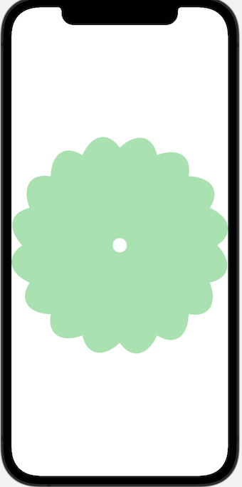
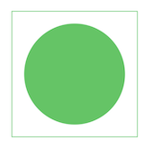
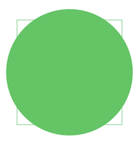
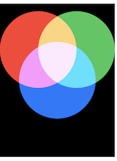
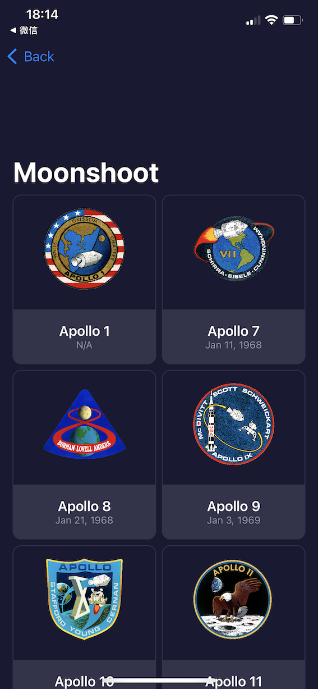
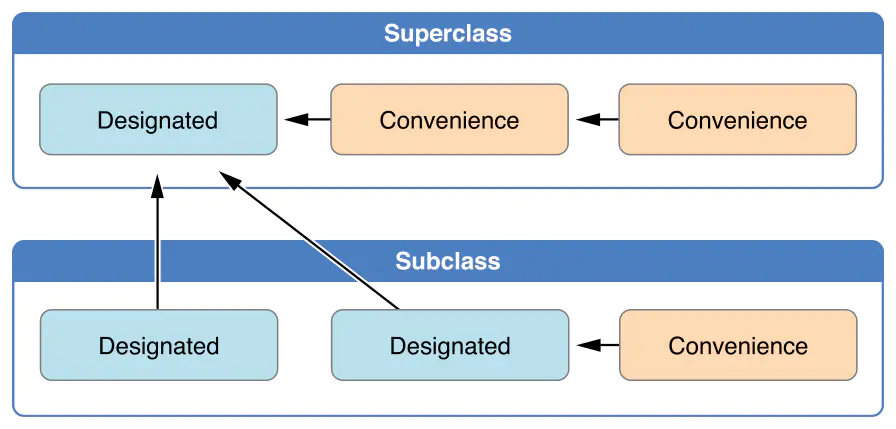
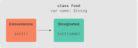
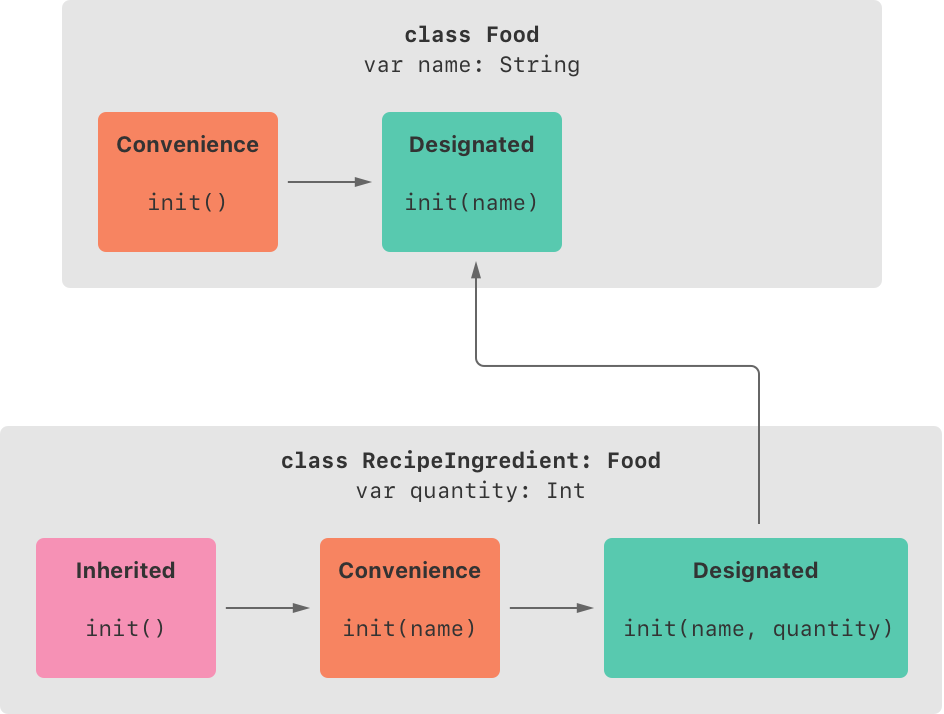

# String

### components(seperatedBy:)
``` Swift
let input = "a b c"
let letters = input.components(separatedBy: " ")
print(letters)
// ["a", "b", "c"]
```

### trimmingCharacters(in:)
we can ask Swift to trim all whitespace at the start and end of a string like this:
``` Swift
let trimmed = someString.trimmingCharacters(in: .whitespacesAndNewlines)
```

### 读取txt文件中的内容,并转化成String
``` Swift
// 例如读取项目中的start.txt文本文件中的内容,
// 此外,该文本每行一个单词,随机读取一个单词:
if let contentOfTxt = Bundle.main.url(forResource: "start", withExtension: "txt") {
    if let contentOfString = try? String(contentsOf: contentOfTxt) {
        let allWords = contentOfString.components(separatedBy: "\n")
        var randomWord = allWords.randomElement() ?? ""
        // 如果在func中,需要空return,并在下面if之外fatalError()
        // return
    }
}
// fatalError()
```

### UITextChecker
UITextChecker类来源于UIKit,在SwiftUI没有替代方案的情况下,只能使用该方法了。
方法的解释可以参考下面的文章:
> https://www.hackingwithswift.com/books/ios-swiftui/working-with-strings
> https://www.hackingwithswift.com/books/ios-swiftui/validating-words-with-uitextchecker

注意：
UITextChecker uses the built-in system dictionary.我们不用为其特意准备单词表等文档。

#### NSRange && rangeOfMisspelledWord && NSNotFound

``` Swift
// rangeOfMisspelledWord:
// Initiates a search of a range of a string for a misspelled word.
func rangeOfMisspelledWord(in stringToCheck: String, 
                     range: NSRange, 
                startingAt startingOffset: Int, 
                      wrap wrapFlag: Bool, 
                  language: String) -> NSRange
```

#### 案例目的: 查询一串string是否存在拼写错误
``` Swift
func isReal(word: String) -> Bool {
    let checker = UITextChecker()
    let range = NSRange(location: 0, length: word.utf16.count)
    let misspelledRange = checker.rangeOfMisspelledWord(in: word, range: range, startingAt: 0, wrap: false, language: "en")
    
    return misspelledRange.location == NSNotFound
}
/*
This method will make an instance of UITextChecker, which is responsible for scanning strings for misspelled words. We’ll then create an NSRange to scan the entire length of our string, then call rangeOfMisspelledWord() on our text checker so that it looks for wrong words. When that finishes we’ll get back another NSRange telling us where the misspelled word was found, but if the word was OK the location for that range will be the special value NSNotFound.
*/
```

# 
### 读取JSon文件里的内容并形成一个Struct实例
这里是一个泛型函数(GenericFunction)，传入的参数T要求遵守Decodable协议
为什么T要符合Decodable协议?
因为要从JSon文件中取得数据,就存在将结果解码decode的过程,
所以这里要返回的是一个遵循Decodable协议的T类型。

``` Swift
extension Bundle {
    func decode<T: Decodable>(_ filename: String) -> T {        
        // 关于Bundle:
        // 当Xcode构建iOS app时,即创建了一种叫Bundle的东西,它可以存在app中所有的文件.
        // 当要读取main app bundle里的一个文件时,就用到了Bundle.main.url(),
        // Bundle.main.url()得到的是一个optional,所以需要解包.
        guard let url = Bundle.main.url(forResource: filename, withExtension: nil) else {
            fatalError("Failed to locate \(filename) in bundle.")
        }
        
        guard let data: Data = try? Data(contentsOf: url) else {
            fatalError("Failed to load \(filename) from bundle.")
        }
        
        let decoder = JSONDecoder()

        // 对日期类字符串的显示格式的转换
        // 前提是转换目标的struct中某个property的格式是Date的情况下会自动套用
        let formatter = DateFormatter()
        formatter.dateFormat = "y-mm-dd"
        decoder.dateDecodingStrategy = .formatted(formatter)

        guard let loaded = try? decoder.decode(T.self, from: data) else {
            fatalError("Failed to decode \(filename) from bundle.")
        }

        return loaded
    }
}
```
此时,如何调用是个问题:
``` Swift
// 这个代码会出错！！！
let astronauts = Bundle.main.decode("astronauts.json")
```
以上代码会出现“Generic parameter 'T' could not be inferred！
那么如何去说明这个generics泛型呢？
``` Swift
// 这是正确调用的代码！！！
// astronauts要说明类型！！！
let astronauts: [String: Astronaut] = Bundle.main.decode("astronauts.json")
```

### 对于JSon数据中存在变量名是snake case的情况,如何转换成struct的属性名是camel case? -- keyDecodingStrategy
一般我们的struct的属性名都是CamelCase的,比如firstName,但我们会遇到某些JSon数据中存在变量名是snake_case的情况,比如first_name,那么如何decode呢？
下面的例子:
``` Swift
// User结构
struct User: Codable {
    var firstName: String
    var lastName: String
}

// 存在sname case结构的字符串存有json数据
let str = """
{
    "first_name": "Andrew",
    "last_name": "Glouberman"
}
"""

// 下面的步骤:
let data = Data(str.utf8)

do {
    let decoder = JSONDecoder()
    // 下面这行是关键
    decoder.keyDecodingStrategy = .convertFromSnakeCase

    let user = try decoder.decode(User.self, from: data)
    print("Hi, I'm \(user.firstName) \(user.lastName)")
} catch {
    print("Whoops: \(error.localizedDescription)")
}

```

### 对于struct属性名是firstName,而JSon数据中却只是first的属性名,如何解决并最终正确decode？
``` Swift
// User结构
struct User: Codable {
    var firstName: String
    var lastName: String
}

// JSon字符串变成了这样
let str = """
{
    "first": "Andrew",
    "last": "Glouberman"
}
"""
// 
```
这时候对User结构进行如何改变:
``` Swift
struct User: Codable {
    enum CodingKeys: String, CodingKey {
        case firstName = "first"
        case lastName = "last"
    }

    var firstName: String
    var lastName: String
}
```
这样就可以进行decode操作了吗？具体还未操作过,以后遇到了再来补充这个笔记。


### Codable协议
Codable协议的一个简单实例
Codable protocol is composed of Encodable and Decodable.
Codable = Encodable & Decodable

``` Swift
import Foundation

// JSon是类似于{"id":"1001","name":"Shaddy","grade":11}这样的数据格式,
// 而Codable协议,可编码为在网络上最广泛使用的JSon数据格式,
// 后续进行JSONEncoder().encode()编码时,放入的参数必须遵循该协议
struct Student: Codable {
    var id: String
    var name: String
    var grade: Int
}

let student = Student(id: "1001",name: "Shaddy", grade: 11)

do {
    // 将遵循Codable协议的结构,转换为JSon数据
    let jsonEncoder = JSONEncoder()
    // jsonEncoder.encode(_ value: Encodable)
    let jsonData = try jsonEncoder.encode(student)

    // 这里为了方便显示,将jsonData转换为字符串形式,实际项目中直接将jsonData传出即可
    let jsonString = String(decoding: jsonData, as: UTF8.self)
    print("result: \(jsonString)")
    // result: {"id":"1001","name":"Shaddy","grade":11}

    // 这里将json数据解码decode回来
    let jsonDecoder = JSONDecoder()
    // jsonDecoder.decode(type: Decodable.Protocol, from: Data)
    let jsonDecoderData = try jsonDecoder.decode(Student.self, from: jsonData)
    print("result: \(jsonDecoderData)")
    // result: Student(id: "1001", name: "Shaddy", grade: 11)
}
```
> https://www.jianshu.com/p/f39994e045d2


此外,这是一个Codable协议的具体实例,可以用来处理具体从外部拿到的json数据:
视频地址:
> https://www.bilibili.com/video/BV1pb4y1X7ZH?p=22

代码如下:
``` Swift
import SwiftUI

//struct CustomerModel: Identifiable, Decodable, Encodable {
struct CustomerModel: Identifiable, Codable {
    let id: String
    let name: String
    let points: Int
    let isPremium: Bool
    
    // 因为CustomerModel遵循Codable协议,
    // 所以下面的init(from decoder: Decoder)
    // 和enum CodingKeys: String, CodingKey
    // 和func encode(to encoder: Encoder)都不需要去定义了
//    enum CodingKeys: String, CodingKey {
//        case id
//        case name
//        case points
//        case isPremium
//    }
//
//    init(id: String, name: String, points: Int, isPremium: Bool) {
//        self.id = id
//        self.name = name
//        self.points = points
//        self.isPremium = isPremium
//    }
//
//    init(from decoder: Decoder) throws {
//        let container = try decoder.container(keyedBy: CodingKeys.self)
//        self.id = try container.decode(String.self, forKey: .id)
//        self.name = try container.decode(String.self, forKey: .name)
//        self.points = try container.decode(Int.self, forKey: .points)
//        self.isPremium = try container.decode(Bool.self, forKey: .isPremium)
//    }
//
//    func encode(to encoder: Encoder) throws {
//        var container = encoder.container(keyedBy: CodingKeys.self)
//        try container.encode(id, forKey: .id)
//        try container.encode(name, forKey: .name)
//        try container.encode(points, forKey: .points)
//        try container.encode(isPremium, forKey: .isPremium)
//    }
}

class CodableViewModel: ObservableObject {
    
    @Published var customer: CustomerModel? = nil
    
    init() {
        getData()
    }
    
    func getData() {
        guard let data = getJSONData() else { return }
        
//        if
//            let localData = try? JSONSerialization.jsonObject(with: data, options: []),
//            let dictionary = localData as? [String: Any],
//            let id = dictionary["id"] as? String,
//            let name = dictionary["name"] as? String,
//            let points = dictionary["points"] as? Int,
//            let isPremium = dictionary["isPremium"] as? Bool {
//
//            let newCustomer = CustomerModel(id: id, name: name, points: points, isPremium: isPremium)
//            customer = newCustomer
//
//        }
        
//        do {
//            self.customer = try JSONDecoder().decode(CustomerModel.self, from: data)
//        } catch let error {
//            print("Error Decoding. \(error)")
//        }
        
        // 因为CustomerModel遵循Decodable协议,所以可以使用JSONEncoder().decode
        self.customer = try? JSONDecoder().decode(CustomerModel.self, from: data)

    }
    
    // getJSONData方法是从网站等取得数据的,所以返回的Data是一个Optional,因为有可能失败
    // Data格式理解为是类似Json格式类的数据

    func getJSONData() -> Data? {
        
        // 如果拿到的是一个符合CustomerModel的struct,如何转换成jsonData的数据:
//        let customer = CustomerModel(id: "123", name: "Vi", points: 100, isPremium: true)
//        // 因为CustomerModel遵循Encodable协议,所以可以使用JSONEncoder().encode
//        let jsonData = try? JSONEncoder().encode(customer)
        
        // 下面是fake了一些json数据
        let dictionary: [String: Any] = [
            "id": "12345", "name": "Joe", "points": 5, "isPremium": true
        ]

        // 使用JSONSerialization.data方法将JSONObject转换成JSONData
        let jsonData = try? JSONSerialization.data(withJSONObject: dictionary, options: [])
        
        return jsonData
        
    }
}

struct CodableBootcamp: View {
    
    @StateObject var vm = CodableViewModel()
    
    var body: some View {
        VStack(spacing: 20) {
            if let customer = vm.customer {
                Text(customer.id)
                Text(customer.name)
                Text("\(customer.points)")
                Text(customer.isPremium.description)
            }
        }
    }
}
```


``` Swift
//从特定网页取数据
import UIKit
struct User: Decodable {
    var id: Int
    var name: String
    var username: String
    var email: String
    var phone: String
    var website: String
    var company: Company
    var address: Address
}

let url2 = URL(string: “https://jsonplaceholder.typicode.com/users")!
let session = URLSession.shared
session.dataTask(with: url2) { (data, response, error) in
    guard 
        let data = data,
        error == nil,
        let response = response as? HTTPURLResponse,
        rsponse.statusCode >= 200 && response.statusCode < 300
    else {
        print("Error downloading data.")
        return
    }

    do{
        //原始解析方法
//                let json = try JSONSerialization.jsonObject(with: data, options: .mutableLeaves)
//                print(json)

        let users = try JSONDecoder().decode([User].self, from: data)
//        print(users)
        for user in users{
            print(user.address.geo.lat)
        }
    }catch{
        print(error)
    }
}.resume()
```

### @Binding页面如何初始化preview
因为某些页面有初始化@Binding的变量,那么该页面需要preview的话,如何生成预览呢？
一个是自己生成一些测试数据,
另一个就是使用.constant函数:
``` Swift 
struct RFSearchListView_Previews: PreviewProvider {

    static var previews: some View {
        RFSearchListView(items: .constant(["a","b","C"]))
    }
}
```
在Picturepreview项目中的PicturePreview.swift文件中,
使用的是:
``` Swift
PicturePreview(pictures: pictures, selectedPicture: .constant(nil))
```

### Substring 与 String
Substring并不是String的子类，这是两个不同的类型，但是它们都继承了StringProtocol协议，因此存在一些共性；在开发中Substring并不常用(目前只在分割String见到)，所以往往要转成String。
字符串使用split()分割的时候,得到的是[Sbustring],所以要得到[String]的话,还需要再转换。
比如：
``` Swift
var a:[String] = “”“
A
B
“””.split(separator: “\n”).map{String($0)}
```
必须要把Substring转换成String才行。

### Identifiable的使用
我们知道,当遍历一个结构的时候,
比如
``` Swift
struct SomeItem { let id = UUID() }
ForEach(someItems, id:\.id)
```
或者上述结构没有定义id时,则需要用到：
``` Swift
ForEach(someItems, id:\.self),
```
因此需要带有id:\.id或者id:\.self。
但Identifiable就比较方便了：
``` Swift
struct SomeItem: Identifiable { let id = UUID() }
```
这时候就可以这样简便的：
``` Swift
ForEach(someItems) { item in
      	……
}
```

### ForEach中\\.self使用的注意事项
看了文章,发现ForEach中若使用到id:\.self,则该struct之类的必须实现Hashable,实质上就是把每个item实现hashable,以便能够识别出来。
下面对象遵循了Identifiable协议,也是变相地遵循Hashable以便能够识别。

如果一个对象遵循Identifiable协议,比如:
``` Swift
struct Student: Identifiable {
    let id: UUID = UUID()
    var name: String
    var strings: [String]
    var colors: [Color]
}
```
那么可以在ForEach中这样使用：
``` Swift
var students: [Student] = [
    Student(name: "A", strings: ["a"], colors: [Color(.green)]),
    Student(name: "B", strings: ["b"], colors: [Color(.green)]),
    Student(name: "C", strings: ["c"], colors: [Color(.red)])
]
ForEach(students) { student in
    print(student.name)
}
```
显示结果为：
> A B C

当Student遵循Identifiable协议时,ForEach中就不必使用id:\\.self。
如果不遵循Identifiable协议时,就需要我们指定唯一属性的key path,
（Student下面的name/strings/colors属性都可以作为key path来使用,
因为都可以计算哈希值）
但如果连key path也没有的话,我们可以用\\.self。
当使用\.self时,就是将整个结构对象的组合(如students)中的每个元素来一一迭代的话,
就需要被迭代的每个元素结构遵循Hashable协议，例如：
``` Swift
struct Student: Hashable {
    var name: String
    var strings: [String]
    var colors: [Color]
}
```
此时,ForEach内可以使用id的是:
\\.self | \\.name | \\.strings | \\.colors
而如果Student既不遵循Identifiable,也不遵循Hashable:
``` Swift
struct Student {
    var name: String
    var strings: [String]
    var colors: [Color]
}
```
那么ForEach内可以使用id的是:
\\.name | \\.strings | \\.colors
也就是说\\.self不能使用。

实际上,ForEach是在检索每个被迭代元素的哈希值,所以对于一个结构来说，一定要经过遵循并计算哈希值后,才可以被迭代。

如果哈希值相同的情况,会出现什么问题呢？
``` Swift
ForEach(students, id:\.colors) {
    student in
    print(student.name)
}
```
因为Students中前两个元素的colors属性完全相同,
那么初始计算的时候,这两个元素的索引哈希值也相同,
所以显示结果是：
> A A C

这是平时使用当中需要注意的问题。


### Alamofire模块的导入及使用
#### Alamofire模块的导入
1. 从github下载, https://gitcode.net/mirrors/Alamofire/ ,并解压
2. 打开需要使用Alamofire的项目,菜单栏中:File->Add Files to “项目名称”
3. 在弹出选择界面勾选“Copy items if needed”,找到下载解压好的Alamofire位置,选择Alamofire.xcodeproj
4. 但有时以上做完,还是无法import Alamofire,这时要在xcode的项目目录，选择最外层这个项目名称，基本的General设置里的Frameworks,Libraries,and Embedded Content里将Alamofire添加到项目的静态库中
5. 接下来项目就可以import Alamofire了。
#### Alamofire模块的使用
貌似还没法用,下次有机会再试一下
关于使用方法在：https://www.jianshu.com/p/07b1ec36a689
以后可以参考下，但Alamofire.request这个方法就不可以用了

### ProgressView 进度条
用法:
``` Swift
ProgressView(value: 5, total: 15)
```
或者:
``` Swift
ProgressView(value: 0.5)
```

#### .progressViewStyle
为了让progress进度条更好看一些,
创建一个SwiftUI文件,比如ScrumProgressViewStyle.swift:
``` Swift
import SwiftUI

struct ScrumProgressViewStyle: ProgressViewStyle {
    var color1: Color 
    var color2: Color
    func makeBody(configuration: Configuration) -> some View {
        ZStack {
            RoundedRectangle(cornerRadius: 10.0)
                .fill(color1)
                .frame(height: 20.0)
            if #available(iOS 15.0, *) {
                ProgressView(configuration)
                    .tint(color2)
                    .frame(height: 12.0)
                    .padding(.horizontal)
            } else {
                ProgressView(configuration)
                    .frame(height: 12.0)
                    .padding(.horizontal)
            }
        }
    }
}

struct ScrumProgressViewStyle_Previews: PreviewProvider {
    static var previews: some View {
        ProgressView(value: 0.4)
            .progressViewStyle(ScrumProgressViewStyle(color1: .blue, color2: .green))
            .previewLayout(.sizeThatFits)
    }
}
```

### 为Label的.labelStyle这一modifier,创建新的样式即.trailingIcon,并遵循LabelStyle协议
例如：
``` Swift
Label("10", systemImage: "clock)
    .labelStyle(.xxx) 
```
其中.xxx可以选择 .iconOnly / .titleAndIcon / .titleOnly等等来使用
(只显示icon / 按照 icon + title 的次序显示 / 只显示title)。
而此处为其添加新的选项,即 .trailingIcon,看字面意思就是和.titleAndIcon相反的,
即把Icon放最后,而title放前面的意思。
具体实现：

``` Swift
import SwiftUI

struct TrailingIconLabelStyle: LabelStyle {
    func makeBody(configuration: Configuration) -> some View {
        HStack {
            configuration.title
            configuration.icon
        }
    }
}

extension LabelStyle where Self == TrailingIconLabelStyle {
    static var trailingIcon: Self { Self() }
}
```

如何使用：
``` Swift

Label("10", systemImage: "clock")
    .labelStyle(.trailingIcon)
```

### .onDelete -- ForEach所独有的删除内部元素的功能
> 注意: List没有.onDelete这个midifier,但一般都是List里面嵌套ForEach,在ForEach上添加.onDelete。

在Section内使用Foreach来依次显示列表内的内容时,
在ForEach内可以使用.onDelete来划动删除特定项。
当划动特定项时,会出现划动后的红色“删除”字样：

``` swift
Section(header: Text("Attendees")) {
    ForEach(data.attendees) { attendee in
        Text(attendee.name)
    }
    .onDelete { indices in
        data.attendees.remove(atOffsets: indices)
    }
}
```

### .swipeAction(edge:allowsFullSwipe:content:) 好于.onDelete功能
``` Swift
// 例子中是放在List里面,而非Section中
Section(header: Text("Attendees")) {
    ForEach(data.attendees) { attendee in
        Text(attendee.name)
    }
    .swipeActions(edge: .trailing,
        allowsFullSwipe: false) {
            Button("Archive") {}
                .tint(.green)
            Button("Save") {}
                .tint(.blue)
            Button("Junk") {}
                .tint(.black)
        }
    .swipeActions(edge: .leading,
        allowsFullSwipe: true) {
            Button("Share") {}
                .tint(.yellow)
        }    
}
```
里面,对每个字元素右滑动,会出现三个选项:"Archive"/"Save"/"Junk",
而左滑动会出现一个选项:"Share".
allowsFullSwipe表示是否从头滑到尾。一般一个按钮的时候可以,多个按钮的时候不建议。


## Button

### 停用Button -- .disabled
``` Swift
Button(action:{}) {}
    .disabled(someBoolVariableIsEmpty)
```
当变量someBoolVariableIsEmpty为false时,该Button将会被停用。

### .buttonStyle(.xxx) / .controlSize(.large) / .buttonBorderShape(.xxx)
Button的修饰符.buttonStyle(.xxx)以及.controlSize(.xxx) / .buttonBorderShape(.xxx)
可以在使用的时候自己调试下,一些系统默认给的样式。

### sheet modifier on List 的使用
``` Swift
List()
    .sheet(isPresented: $isPresented) {
        ...
    }
```
参数isPresented需要传入的是一个Binding<Bool>。
可以这样理解,因为该sheet会被下拉而退出,
但若下拉后该isPresented参数不被变更为false,则sheet仍会被展现,
这明显是错误的,所以需要进行绑定参数,而非仅仅传一个值给sheet。

### sheet加载的View页面的dismiss
#### 使用@Environment(\.presentationMode)不显示该View
在sheet加载的View中设定一个变量:
``` Swift
@Environment(\.presentationMode) var presentationMode
```
当要不显示该View时,执行代码:
``` Swift
presentationMode.wrappedValue.dismiss()
```
即可。

#### 使用@Environment(\.dismiss)
在sheet加载的View中设定一个变量:
``` Swift
@Environment(\.dismiss) var dismiss
```
当要不显示该View时,执行代码:
``` Swift
dismiss()
```
即可。


### .fullScreenCover
类似于.sheet(),参数也是一样的,但是可以全屏显示的View
> .fullScreenCover(isPresented: content:)

``` Swift
Button() {

}
.fullScreenCover(isPresented:$variable, content: {
    OtherView()
})
```
但是.sheet()加载的弹出页面可以下拉操作,.fullScreenzCover()不可以,所以还是推荐前者。

### toolbar 此modifier 的使用
在List的右上角显示工具栏
显示一个"edit"的button按钮：
``` Swift
List()
    .toolbar {
        Button("edit") {
            ...
        }
    }
```
在一个View上面显示"Cancel"和"Done"按钮：
``` Swift
View()
    .toolbar {
        ToolbarItem(placement: .cancellationAction) {
            Button("Cancel") {
                isPresentingEditView = false
            }
        }
        ToolbarItem(placement: .confirmationAction) {
            Button("Done") {
                isPresentingEditView = false
                scrum.update(from: data)
            }
        }
    }
```
两个按钮是平行排列的，感觉当中还夹着一个Spacer()。

#### toolbar 之 默认方法EditButton()的使用 -- 也是针对ForEach而使用
``` Swift
List{
    ForEach(...) {
        ......
    }
}
.toolbar {
    // 会让展示列表的各个选项前出现类似删除的标志
    EditButton()
}
```

### @State 与 @StateObject / @ObservedObject / @EnvironmentObject 的区别？
the @State property wrapper works only for value types, such as structures and enumerations.
@ObservedObject, @StateObject, and @EnvironmentObject declare a reference type as a source of truth. To use these property wrappers with your class, you need to make your class observable.
总结下来:
1.@State 仅用于Struct 和 Enum 等 值类型，存储在View内部；而@StateObject、@ObservedObject和@EnvironmentObject用于引用类型,即class对象，存储在View外部（但可以在View内部命名）。
2.若要使用@ObservedObject、@StateObject和@EnvironmentObject的话，要使得对应的class实现ObservableObject协议。

### @StateObject / @ObservedObject 两者如何区别使用?

看下来的心得：
定义@ObservedObject的View,如果是作为subView的话,那么当parentView中的视图存在更新的情况下,这个subView中的@ObservedObject属性就会再次创建。因此,subView只做展示,该subView自身不会主动做数据更新(若要自身主动更新,则使用@StateObject,但注意性能消耗问题）。
但另一种情况,parentView是通过@StateObject来创建对象,subView中是使用了@ObservedObject来接收对象,则不会让页面的数据产生错乱。例如下面的例子:
``` Swift
class UserProgress: ObservableObject {
    @Published var score = 0
}

struct InnerView: View {
    // subView使用@ObservedObject来接收对象！！！
    @ObservedObject var progress: UserProgress

    var body: some View {
        Button("Increase Score") {
            progress.score += 1
        }
    }
}

struct ContentView: View {
    // parentView使用@StateObject来创建对象！！！
    @StateObject var progress = UserProgress()

    var body: some View {
        VStack {
            Text("Your score is \(progress.score)")
            InnerView(progress: progress)
        }
    }
}
```
记住: 不要使用@ObservedObject来创建实例,假如你真的要这么做,使用@StateObject.

下面的内容是从其他地方总结下来的,暂且放一下吧,领会上面的就够了,而且验证下来上面是对的。
> https://blog.csdn.net/fzhlee/article/details/114269326
若是在某个View中使用@ObservedObject来创建一个实例,当这个View页面刷新时,这个@ObservedObject创建的实例会再次创建,这会给大多数场景带来意外(比如你已经改变过该实例的属性的值了,突然它又重新创建了一遍,那改变的值又还原了)。所以,此时使用@StateObject来创建实例比较好,因为它有储存属性,而不像@ObservedObject,具有@ObservedObject的视图,但没有保留ObservableObject，则每次该视图重绘其主体时都会创建一个新实例。

但是,这不意味着要将所有@ObservedObject属性均标记为@StateObject。若每次重新绘制视图时,都要重新创建@StateObject实例的话,则会消耗性能。此外,如果本意就是要创建一个新的实例的情况下,那么新实例就会被忽略,从而引起一个隐藏的错误。

简单来说,对于在使用它的视图中初始化的所有可观察属性，都应使用@StateObject。如果ObservableObject实例是在外部创建的，并传递给使用它的视图，请使用@ObservedObject标记您的属性。 

@StateObject -- Use this on certain / init
@ObservedObject -- use this for subviews

我们也可以说,@EnvironmentObject与@StateObject一样,都有存储属性。

此外,从外部文章中找到的 @StateObject / @ObservedObject 两者如何区别使用的解答:
When you want to use a class instance elsewhere – when you’ve created it in view A using @StateObject and want to use that same object in view B – you use a slightly different property wrapper called @ObservedObject. That’s the only difference: when creating the shared data use @StateObject, but when you’re just using it in a different view you should use @ObservedObject instead.

### 如何让 @Published 遵循Codable协议
我们定义一个名为User的class,并遵循Codable协议,再定义一个@Published属性name:
``` Swift
class User: ObservableObject, Codable {
    @Published var name = "Paul Hudson"
}
```
报错信息为：
Type 'User' does not conform to protocol 'Encodable'.
如何解决这个问题:
> https://www.hackingwithswift.com/books/ios-swiftui/adding-codable-conformance-for-published-properties

``` Swift
class User: ObservableObject, Codable {
    @Published var name = "Paul Hudson"
    
    enum CodingKeys: CodingKey {
        case name
    }
    
    required init(from decoder: Decoder) throws {
        let container = try decoder.container(keyedBy: CodingKeys.self)
        name = try container.decode(String.self, forKey: .name)
    }
    
    func encode(to encoder: Encoder) throws {
        var container = encoder.container(keyedBy: CodingKeys.self)
        try container.encode(name, forKey: .name)
    }
}
```
总结：
1.设置遵循CodingKey的enum;
2.设置required init(from decoder: Decoder) throws,里面包含到需要decode的@Published元素;
3.设置encode方法,并设置需要encode的@Published元素;
4.只要设置了以上,发现@Published元素即使有很多,只要设置你需要encode和decode的@Published元素即可,并不是每个都要去设置encode和decode的。

### @EnvironmentObject 传值的简单示例
这是需要共享的基本数据：
``` Swift
class User: ObservableObject {
    @Published var name = "Taylor Swift"
}
```
接下来是两个用来接收上述数据的结构类型：
``` Swift
struct EditView: View {
    @EnvironmentObject var user: User

    var body: some View {
        TextField("Name", text: $user.name)
    }
}
struct DisplayView: View {
    @EnvironmentObject var user: User

    var body: some View {
        Text(user.name)
    }
}
```
那么,在ContentView中,如何向EditView()和DisplayView传递一个User对象？
``` Swift
struct ContentView: View {
    let user = User()

    var body: some View {
        VStack {
            EditView().environmentObject(user)
            DisplayView().environmentObject(user)
        }
    }
}
```
也可以把ContentView改成这样：
``` Swift
VStack {
    EditView()
    DisplayView()
}
.environmentObject(user)
```
上例把 user 放到 ContentView 的环境中，但是因为 EditView 和 DisplayView 都是 ContentView 的子视图，所以它们自动继承了 ContentView 的环境。

#### .environmentObject(user) 和 @EnvironmentObject var user: User 之间建立联系的？
你会发现,.environmentObject(user)中只有一个user,而不是(user:user),那@EnvironmentObject var user: User是如何正确识别并接收的呢？
查了资料,有称是通过字典的类型存键和类型存值来进行的。比如键存的是数据类型,就是User,而值就是User()。
真的是这样吗？
那如果我同时传递两个相同类型的对象,接收方如何区分？

### .badge()的使用
一般用于 List / TabView 上.
List的Text上使用:
``` Swift
// 会在第一个Text后面多一个5的标识,某些场景应该用的到
List {
    Text("Hello, world")
        .badge(5)
    Text("Hello!)
}
```
TabView上使用：
``` Swift
TabView {
    Color.red
        .tabItem {
            Image(systemName: "heart.fill")
            Text("Hello")
        }
        .badge("New") // 在Image上角上有一个标识,可以代表有新内容
        // .badge(2) 可以表示有2个更新
    Color.green
        .tabItem {
            Image(systemName: "heart.fill")
            Text("Hello")
        }
}
```
### @FocusState 的使用 (让TextField受到focused)

``` Swift
struct FocusStateBootcamp: View {
    
    // @FocusState不需要赋值,下面的TextField的.focused会自动改变值
    @FocusState private var usernameInFocus: Bool
    @State private var username: String = ""
    @FocusState private var passwordInFocus: Bool
    @State private var password: String = ""

    var body: some View {
        VStack(spacing: 30) {
            TextField("Add your name here ...", text: $username)
                .focused($usernameInFocus)
                .padding(.leading)
                .frame(height: 55)
                .frame(maxWidth: .infinity)
                .background(Color.gray.brightness(0.3))
                .cornerRadius(10)
            SecureField("Add your password here ...", text: $password)
                .focused($passwordInFocus)
                .padding(.leading)
                .frame(height: 55)
                .frame(maxWidth: .infinity)
                .background(Color.gray.brightness(0.3))
                .cornerRadius(10)
            Button("Sign Up 🚀") {
                let usernameIsValid = !username.isEmpty
                let passwordIsValid = !password.isEmpty
                if usernameIsValid && passwordIsValid {
                    print("Sign Up")
                } else if usernameIsValid {
                    usernameInFocus = false
                    passwordInFocus = true
                } else {
                    usernameInFocus = true
                    passwordInFocus = false
                }
            }
        }
        .padding()
        .onAppear {
            DispatchQueue.main.asyncAfter(deadline: .now() + 0.5) {
                self.usernameInFocus = true
            }
        }
    }
}
```
上面的代码设置太多@FocusState,所以用enum来简洁代码:
``` Swift
struct FocusStateBootcamp: View {
    
    // 新增
    // 为什么要符合Hashable,因为下面.focused的参数binding要求
    enum OnboardingFields: Hashable {
        case username, password
    }
    
    // @FocusState private var usernameInFocus: Bool
    @State private var username: String = ""
    //@FocusState private var passwordInFocus: Bool
    @State private var password: String = ""
    
    // 新增
    @FocusState private var fieldInFocus: OnboardingFields?

    var body: some View {
        VStack(spacing: 30) {
            TextField("Add your name here ...", text: $username)
                // .focused($usernameInFocus)
                // .focused(<#T##binding: FocusState<Hashable>.Binding##FocusState<Hashable>.Binding#>, equals: <#T##Hashable#>)
                .focused($fieldInFocus, equals: .username)
                .padding(.leading)
                .frame(height: 55)
                .frame(maxWidth: .infinity)
                .background(Color.gray.brightness(0.3))
                .cornerRadius(10)
            SecureField("Add your password here ...", text: $password)
                // .focused($passwordInFocus)
                .focused($fieldInFocus, equals: .password)
                .padding(.leading)
                .frame(height: 55)
                .frame(maxWidth: .infinity)
                .background(Color.gray.brightness(0.3))
                .cornerRadius(10)
            Button("Sign Up 🚀") {
                let usernameIsValid = !username.isEmpty
                let passwordIsValid = !password.isEmpty
                if usernameIsValid && passwordIsValid {
                    print("Sign Up")
                } else if usernameIsValid {
                    // usernameInFocus = false
                    // passwordInFocus = true
                    fieldInFocus = .password
                } else {
                    // usernameInFocus = true
                    // passwordInFocus = false
                    fieldInFocus = .username
                }
            }
        }
        .padding()
        .onAppear {
            DispatchQueue.main.asyncAfter(deadline: .now() + 0.5) {
                // self.usernameInFocus = true
                self.fieldInFocus = .username
            }
        }
    }
}
```

### .onSubmit / .submitLabel 给TextField的修饰符
使用TextField并focused时候,跳出的键盘右下角就会出现对应的search/next/route字样:
（还有很多其他的可以显示）
``` Swift
VStack {
    TextField("Placeholder...", text: $text1)
        .submitLabel(.route)
        .onSubmit { print("Something to the console!") }
    TextField("Placeholder...", text: $text1)
        .submitLabel(.next)
        .onSubmit { print("Something to the console!") }
    TextField("Placeholder...", text: $text1)
        .submitLabel(.search)
        .onSubmit { print("Something to the console!") }
}
```

### 使用AVFoudation模块的AVPlayer播放声音文件
> 具体使用示例在官方教程中：
> https://developer.apple.com/tutorials/app-dev-training/managing-state-and-life-cycle

``` Swift
import AVFoundation

// 假设声音文件是ding.wav
let url = Bundle.main.url(forResource: "ding", withExtension: "wav")
// 定义player变量
var player: AVPlayer { AVPlayer(url: url) }

// 在View中使用player
// 比如在一个ZStack中
ZStack {}
    // 在ZStack出现时
    .onAppear {
        // 设置从头开始播放
        player.seek(to: .zero)
        // 开始播放
        player.play()
    }
```

### as 的使用
as是个操作符
作用：将派生类转换为基类。

``` Swift
// 这里将int类型的number转换成了Float类型
// 但不能将 number: Int 事先定义类型,会报错
var number = 1 as Float
print(number)
```
> 1.0

## FileManager 的使用
> https://blog.csdn.net/u011146511/article/details/79362028

### 获取用户文档目录路径
FileManager.default.urls(for:in:)
其中for是一个enum,可以查看下,有专门给movie、books、pictures等等很多进行储存的目录等。
此外in也是一个enum,最多用到的就是.userDomainMask
``` Swift
import Foundation

let manager = FileManager.default
let urlForDocument = manager.urls(for: .documentDirectory, in:.userDomainMask)
print(urlForDocument)
let url = urlForDocument[0] as URL
print(url)
print(url.path)
```

> [file:///Users/vito/Library/Developer/XCPGDevices/xxxxxxxxxxxxxxxxx/yyyyyyyyyyyyyyyy/Documents/]
file:///Users/vito/Library/Developer/XCPGDevices/xxxxxxxxxxxxxxxxx/yyyyyyyyyyyyyyyy/Documents/
/Users/vito/Library/Developer/XCPGDevices/xxxxxxxxxxxxxxxxx/yyyyyyyyyyyyyyyy/Documents/

### 对指定路径执行浅搜索，返回指定目录路径下的文件、子目录及符号链接的列表

``` Swift
// 代码接着上面的
let contentsOfPath = try? manager.contentsOfDirectory(atPath: url.path)
print("contentsOfPath: \(contentsOfPath)")
```

> contentsOfPath: Optional([])

结果是个Optional的空列表，说明该目录内为空，没有文件、目录等。

### 深度遍历,递归遍历子文件夹
``` Swift
let enumeratorAtPath = manager.enumerator(atPath: url.path)
// let enumeratorAtURL = manager.enumerator(at: url, includingPropertiesForKeys: nil,options: .skipsHiddenFiles, errorHandler:nil)
print("enumeratorAtPath: \(enumeratorAtPath?.allObjects)")
```
> enumeratorAtPath: Optional([])

### 深度遍历，会递归遍历子文件夹（包括符号链接，所以要求性能的话用enumeratorAtPath）
``` Swift
let subPaths = manager.subpaths(atPath: url.path)
print("subPaths: \(subPaths)")
```

#### 通过FileManager在本地建立文件夹并存储文件,以及对应的删除文件夹和文件
下面的例子类似于放入缓存中的NSCache,只是这里是存入用户的文件系统中。
``` Swift
import SwiftUI

class LocalFileManger {
    
    static let instance = LocalFileManger()
    let folderName: String = "MyApp_Images"
    
    init() {
        createFolderIfNeeded()
    }
    
    func createFolderIfNeeded() {
        guard
            let path = FileManager
                .default
                .urls(for: .cachesDirectory, in: .userDomainMask)
                .first?
                .appendingPathComponent(folderName)
                .path
        else {
            return
        }
        
        if !FileManager.default.fileExists(atPath: path) {
            do {
                try FileManager.default.createDirectory(atPath: path, withIntermediateDirectories: true, attributes: nil)
                print("Successfully creating folder.")
            } catch let error {
                print("Error creating folder. \(error)")
            }
        }
    }
    
    func deleteFolder() {
        guard
            let path = FileManager
                .default
                .urls(for: .cachesDirectory, in: .userDomainMask)
                .first?
                .appendingPathComponent(folderName)
                .path
        else {
            return
        }
        
        do {
            try FileManager.default.removeItem(atPath: path)
            print("Successfully deletinging folder.")
        } catch let error {
            print("Error deleting folder. \(error)")
        }

    }
    
    func saveImage(image: UIImage, savedFileName: String) -> String {
        
        guard
            // image.pngData也是有的
            // compressionQuality是压缩比例
            let data = image.jpegData(compressionQuality: 1.0),
            let path = getPathForImage(name: savedFileName)
        else {
            return "Error Getting Data."
        }
        
        // 存储数据
        // data.write(to: URL)
        do {
            try data.write(to: path)
            return "Successful saving."
        } catch let error {
            return "Error saving. \(error)"
        }
    }
    
    func getImage(name: String) -> UIImage? {
        guard
            let path = getPathForImage(name: name)?.path,
            FileManager.default.fileExists(atPath: path)
        else {
            return nil
        }
        
        return UIImage(contentsOfFile: path)
    }
    
    func getPathForImage(name: String) -> URL? {
        // let directory = FileManager.default.urls(for: .cachesDirectory, in: .userDomainMask).first
        // let path = directory?.appendingPathComponent("\(savedFileName).jpg")
        
        guard
            let path = FileManager
                .default
                .urls(for: .cachesDirectory, in: .userDomainMask)
                .first?
                .appendingPathComponent(folderName)
                .appendingPathComponent("\(name).jpg")
        else {
            print("Error getting path.")
            return nil
        }
        return path
    }
    
    func deleteImage(name: String) -> String {
        guard
            let path = getPathForImage(name: name),
            FileManager.default.fileExists(atPath: path.path)
        else {
            return "Error getting path."
        }
        
        do {
            try FileManager.default.removeItem(at: path)
            return "Successfully deleted."
        } catch let error {
            return "Error deleting image. \(error)"
        }
    }
    
}

class FileManagerViewModel: ObservableObject {
    
    // 需要在各个class或struct中移动的时候,
    // Image的数据移动起来相对比较麻烦,
    // 而UIImage相对容易,
    // 所以推荐UIImage作为背景等时,当要作为数据处理的情况.
    @Published var image: UIImage? = nil
    let imageName: String = "threemonths"
    let manager = LocalFileManger.instance
    @Published var infoMessage: String = ""
    
    init() {
        getImageFromAssetsFolder()
        getImageFromFileManager()
    }
    
    func getImageFromAssetsFolder() {
        image = UIImage(named: imageName)
    }
    
    func getImageFromFileManager() {
        image = manager.getImage(name: imageName)
    }
    
    func saveImage() {
        guard let image = image else { return }
        infoMessage = manager.saveImage(image: image, savedFileName: imageName)
    }
    
    func deleteImage() {
        infoMessage = manager.deleteImage(name: imageName)
        manager.deleteFolder()
    }
    
}

struct FileManagerBootcamp: View {
    
    @StateObject var vm = FileManagerViewModel()
    
    var body: some View {
        NavigationView {
            VStack {
                if let image = vm.image {
                    Image(uiImage: image)
                        .resizable()
                        .scaledToFill()
                        .frame(width: 350, height: 500)
                        .clipped()
                    .cornerRadius(10)
                }
                
                HStack {
                    Button {
                        vm.saveImage()
                    } label: {
                        Text("Save to FileManager")
                            .foregroundColor(.white)
                            .font(.headline)
                            .padding()
                            .padding(.horizontal)
                            .background(Color.blue)
                            .cornerRadius(10)
                    }
                    
                    Button {
                        vm.deleteImage()
                    } label: {
                        Text("Delete from FileManager")
                            .foregroundColor(.white)
                            .font(.headline)
                            .padding()
                            .padding(.horizontal)
                            .background(Color.red.opacity(0.7))
                            .cornerRadius(10)
                    }
                }

                Text(vm.infoMessage)
                    .font(.largeTitle)
                    .fontWeight(.semibold)
                    .foregroundColor(.purple)
                
                Spacer()
            }
            .navigationTitle("File Manager")
        }
    }
}
```

### NSCache -- 缓存存储
很多时候,取得的数据不需要存入手机,而只是需要放入缓存中。

下面的例子,类似于FileManager存储image的结构类型,只是存入缓存中:
``` Swift
import SwiftUI

class CacheManager {
    
    static let instance = CacheManager()
    
    private init() {}
    
    // var imageCache: NSCache<AnyObject, AnyObject>
    // 把NSCache想像成key/value的结构,
    // key一般是String,但这里得是个Object,String是一个Struct,
    // 而NSString是一个class类,故此处不能单单使用String.
    // 至于转换, "Hello" as NSString 即完成了将String转换成NSString.
    var imageCache: NSCache<NSString, UIImage> = {
        let cache = NSCache<NSString, UIImage>()
        // cache.countLimit 是指NSCache中Object的最多数量
        cache.countLimit = 100
        // cache.totalCostLimit 是指NSCache的容量限制
        cache.totalCostLimit = 1024 * 1024 * 100 // 100Mb
        
        return cache
    }()
    
    // 添加
    func add(image: UIImage, name: String) -> String {
        // name根据imageCache设定的必须是NSString,而不是String
        imageCache.setObject(image, forKey: name as NSString)
        return "Add to Cache"
    }
    
    func remove(name: String) -> String{
        imageCache.removeObject(forKey: name as NSString)
        return "Remove from Cache"
    }
    
    func get(name: String) -> UIImage? {
        return imageCache.object(forKey: name as NSString)
    }
    
}

class CacheViewModel: ObservableObject {
    
    @Published var startImage: UIImage? = nil
    @Published var cachedImage: UIImage? = nil
    @Published var infoMessage: String = ""
    let imageName: String = "threemonths"
    let manager = CacheManager.instance
    
    init() {
        getImagesFromAssetsFolder()
    }
    
    func getImagesFromAssetsFolder() {
        startImage = UIImage(named: imageName)
    }
    
    func saveToCache() {
        guard let startImage = startImage else { return }
        infoMessage = manager.add(image: startImage, name: imageName)
    }
    
    func removeFromCache() {
        infoMessage = manager.remove(name: imageName)
    }
    
    func getFromCache() {
        if let returnedImage =  manager.get(name: imageName) {
            cachedImage = returnedImage
            infoMessage = "Got image from Cache"
        } else {
            infoMessage = "Image not found from Cache"
        }
    }
    
}

struct CacheBootcamp: View {
    
    @StateObject var vm = CacheViewModel()
    
    var body: some View {
        NavigationView {
            VStack {
                if let image = vm.startImage {
                    Image(uiImage: image)
                        .resizable()
                        .scaledToFill()
                        .frame(width: 200, height: 250)
                        .clipped()
                    .cornerRadius(10)
                }
                
                Text(vm.infoMessage)
                    .font(.headline)
                    .foregroundColor(.purple)
                    .frame(height:30)
                
                HStack {
                    Button {
                        vm.saveToCache()
                    } label: {
                        Text("Save to Cache")
                            .font(.headline)
                            .foregroundColor(.white)
                            .padding()
                            .background(Color.blue)
                            .cornerRadius(10)
                    }
                    
                    Button {
                        vm.removeFromCache()
                    } label: {
                        Text("Delete from Cache")
                            .font(.headline)
                            .foregroundColor(.white)
                            .padding()
                            .background(Color.red)
                            .cornerRadius(10)
                    }
                }
                
                Button {
                    vm.getFromCache()
                } label: {
                    Text("get from Cache")
                        .font(.headline)
                        .foregroundColor(.white)
                        .padding()
                        .background(Color.green)
                        .cornerRadius(10)
                }
                
                if let image = vm.cachedImage {
                    Image(uiImage: image)
                        .resizable()
                        .scaledToFill()
                        .frame(width: 200, height: 250)
                        .clipped()
                    .cornerRadius(10)
                }
                
                Spacer()
            }
            .navigationTitle("Cache")

        }
    }
}
```


### 自定义View的Modifier,并进行调用
``` Swift
import SwiftUI

// 自定义modifier 需要遵循 ViewModifier协议
// 并且在func body(content: Content) -> some View 中定义具体的修饰
struct DefaultButtonViewModifier: ViewModifier {
    let backgroundColor: Color
    
    func body(content: Content) -> some View {
        content
            .foregroundColor(.white)
            .frame(height: 55)
            .frame(maxWidth: .infinity)
            .background(backgroundColor)
            .cornerRadius(10)
            .shadow(radius: 10)
    }
}

// 这是调用上述DefalutButtonViewModifier结构的方法的View的扩展
// 实际是为了让View方便调用才写的
extension View {
    func withDefaultButtonFormatting(backgroundColor: Color = .blue) -> some View {
        // 此处省略了
        // self.
        modifier(DefaultButtonViewModifier(backgroundColor: backgroundColor))
    }
}

struct ContentView: View {
    var body: some View {
        VStack(spacing: 10) {
            // 下面两种不同的调用自定义modifier的方式
            Text("Hello, my world!")
                .font(.headline)
                .withDefaultButtonFormatting()
            Text("Hello, my world!")
                .font(.subheadline)
                .modifier(DefaultButtonViewModifier(backgroundColor: .green))
            Text("Hello, my world!")
                .font(.title)
                .withDefaultButtonFormatting(backgroundColor: .yellow)
        }
        .padding()

    }
}
```

### 为Button自定义样式
``` Swift
import SwiftUI

struct PressableButtonStyle: ButtonStyle {
    
    let scaledAmount: CGFloat
    
    init(scaledAmount: CGFloat) {
        self.scaledAmount = scaledAmount
    }
    
    func makeBody(configuration: Configuration) -> some View {
        // configuration可以使用到
        // configuration.isPressed 代表button被按下
        // configuration.label是用来调整button的label的
        configuration.label
            .scaleEffect(configuration.isPressed ? scaledAmount : 1.0)
            .opacity(configuration.isPressed ? 0.9 : 1.0)
            .brightness(configuration.isPressed ? 0.5 : 0)
    }
}

extension View {
    
    func withPressableStyle(scaledAmount: CGFloat = 0.9) -> some View {
        self.buttonStyle(PressableButtonStyle(scaledAmount:scaledAmount))
    }
    
}

struct Test0004: View {
    var body: some View {
        Button(action: {
            
        },label: {
            Text("Click Me")
                .font(.headline)
                .foregroundColor(.white)
                .frame(height: 55)
                .frame(maxWidth: .infinity)
                .background(Color.blue)
                .cornerRadius(10)
                .shadow(color: Color.blue.opacity(0.3),
                        radius: 10, x: 0.0, y: 10)
        })
            // 以下样式都是自带的
            // .buttonStyle(PlainButtonStyle())
            // .buttonStyle(DefaultButtonStyle())
            //使用自定义样式
            // .buttonStyle(PressableButtonStyle(scaledAmount: 0.9))
            // 建议这样调用,因为上面写了调用的方法
            .withPressableStyle(scaledAmount: 1.2)
            .padding(40)
    }
}

```
# transition

### 一般用法:
.transition(.scale) 
即让尺寸大小的变化有一个过渡。

### .asymmetric
.asymmetric lets us use one transition when the view is being shown and another when it’s disappearing. 
``` Swift
.transition(.asymmetric(insertion: .scale, removal: .opacity))
```
即在进入的时候以尺寸变化为过渡,而在不显示的时候通过显示透明度消失的方式。


### 建立自定义Transition
具体定义是:
``` Swift
extension AnyTransition {

    /// Returns a transition defined between an active modifier and an identity
    /// modifier.
    public static func modifier<E>(active: E, identity: E) -> AnyTransition where E : ViewModifier
}
```
具体实例一:
``` Swift

import SwiftUI

struct CornerRotateModifier: ViewModifier {
    let amount: Double
    let anchor: UnitPoint
    
    func body(content: Content) -> some View {
        content
            .rotationEffect(.degrees(amount), anchor: anchor)
            // .clipped()是以防绕出整体范围的时候进行一个切割
            .clipped()
    }
}

extension AnyTransition {
    static var pivot: AnyTransition {
        // 初始状态是绕着支点逆时针旋转90度,最后状态是顺时针旋转90度绕回原点
        .modifier(active: CornerRotateModifier(amount: -90, anchor: .topLeading),
                  identity: CornerRotateModifier(amount: 0, anchor: .topLeading))
    }
}

struct Transitions: View {
    
    @State private var isShowingRed = false
    
    var body: some View {
        ZStack {

            // 蓝色在红色的下方,但红色因为逆时针旋转出区域又经过.clipped()切割,所以一开始看不到,
            // isShowingRed转变为true时,红色区域顺时针旋转回来时,能看到红色区域旋转并覆盖蓝色区域。

            Rectangle()
                .fill(.blue)
                .frame(width: 200, height: 200)
            

            if isShowingRed {
                Rectangle()
                    .fill(.red)
                    .frame(width: 200, height: 200)
                    .transition(.pivot)
            }
        }
        .onTapGesture {
            withAnimation {
                isShowingRed.toggle()
            }
        }
    }
}

```

具体实例二:
``` Swift
struct RotateViewModifier: ViewModifier {
    
    let rotation: Double
    
    func body(content: Content) -> some View {
        content
            .rotationEffect(Angle(degrees: rotation))
            // 当showRectangle变为true的时候,content出现,
            // 则content的位移offset就是(x:0,y:0);
            // 当showRectangle变为false的时候,content离开画面,
            // 而且content的位移offset就是(x:屏幕宽度,y:屏幕高度);
            // 若下面设置成UIScreen.main.bounds.width/5的时候，
            // 你就会发现content在x和y上位移了一点点,随后全部消失
            .offset(
                x: rotation != 0 ? UIScreen.main.bounds.width : 0,
                y: rotation != 0 ? UIScreen.main.bounds.height : 0
            )
    }
}

extension AnyTransition {
    
    // 虽然都是rotating,但调用的时候提示是V,代表是Variable
    static var rotating: AnyTransition {
        // .modifier(active:开始, identity:结束)
        // 当content出现的时候,
        // 是从RotateViewModifier(rotation: 1080) [即<-content旋转1080度],
        // 变化到RotateViewModifier(rotation: 0)[即<-content旋转0度]的。
        // 另外观察下来,
        // 当content离开的时候,
        // 是从RotateViewModifier(rotation: 0)
        // 变化到RotateViewModifier(rotation: 90),
        // 理解下来就是逆向的一个动画过程。
        return AnyTransition.modifier(
            active: RotateViewModifier(rotation: 1080),
            identity: RotateViewModifier(rotation: 0)
        )
    }
    
    // 虽然都是rotating,但调用的时候提示下面是M,代表是Method
    static func rotating(rotation: Double) -> AnyTransition {
        return AnyTransition.modifier(
            active: RotateViewModifier(rotation: 1080),
            identity: RotateViewModifier(rotation: 0))
    }
    
    // 你会发现,content是从右下角出现的,因为设置的offset,
    // (教程演示是这样,但实际却是直接出现,神奇，哪里的问题？)
    // 但离开并不按照offset设置的向右下角消失,
    // 而是向.leading方向消失的。
    // 注:asymmetric是不对称的意思。
    static var rotateOn: AnyTransition {
        return AnyTransition.asymmetric(
            insertion: .rotating,
            removal: .move(edge: .leading))
    }
    
}

struct Test0005: View {
    
    @State private var showRectangle: Bool = false
    
    var body: some View {
        
        VStack {
            Spacer()
            
            if showRectangle {
                RoundedRectangle(cornerRadius: 25)
                    .frame(width: 250, height:350)
                    // 为什么.frame(maxWidth:maxHeight:)会把下面的按钮往下推？
                    .frame(maxWidth: .infinity, maxHeight: .infinity)
                    // .modifier(RotateViewModifier(rotation: 45))
                    .transition(AnyTransition.rotating.animation(.easeInOut(duration: 5.0)))
                    // 调用上面写的rotating方法,好处是还可以传参
                    // .transition(AnyTransition.rotating(rotation: 1080).animation(.easeInOut(duration: 5.0)))
                    // 调用上面写的rotateOn属性
                    // .transition(AnyTransition.rotateOn)
            }else{
                RoundedRectangle(cornerRadius: 25)
                    .frame(width: 250, height:350)
                    .opacity(0.2)
                    .transition(AnyTransition.rotating.animation(.easeInOut(duration: 5.0)))
            }
            
            
            Text("Click Me")
                .withDefaultButtonFormatting(backgroundColor: .gray)
                .padding(.horizontal, 40)
                .onTapGesture {
                    withAnimation(.easeInOut(duration: 5.0)) {
                        showRectangle.toggle()
                    }
                }
            
            Spacer()
        }
    }
}
```

# gesture -- modifier
SwiftUI提供了一系列的手势支持，比如 TapGesture, DragGesture, RotationGesture, MagnificationGesture, LongPressGesture等。

### DragGesture -- 拖动的手势
``` Swift
// 效果: 可拖动,但拖动完,仍会回到原始位置。
@State private var dragAmount: CGSize = CGSize.zero

LinearGradient(gradient: Gradient(colors: [.yellow, .red]), startPoint: .topLeading, endPoint: .bottomTrailing)
    .frame(width:300, height: 200)
    .clipShape(RoundedRectangle(cornerRadius: 10))
    .offset(dragAmount)
    .gesture(
        DragGesture()
            .onChanged({
                dragAmount = $0.translation
            })
            .onEnded({_ in
                dragAmount = .zero
            })
    )
```

### .onLongPressGesture
.onTapGesture 按下即执行,而.onLongPressGesture是对按下有时间和偏移量均有一定的要求:

.onLongPressGesture(minimumDuration: <#T##Double#>, maximumDistance: <#T##CGFloat#>, perform: <#T##() -> Void#>, onPressingChanged: <#T##((Bool) -> Void)?##((Bool) -> Void)?##(Bool) -> Void#>)

minimumDuration 指至少按住多少时间才生效
maximumDistance 指最多位移多少范围才有效,不然认为是撤销操作
onPressingChanged 指一旦按下即会进行的操作(给了个判断是否按下的Bool参数)
perform 指超过minimumDuration,且未超过maximumDistance，的情况下,会进行的操作

``` Swift
struct LongPressGestureBootcamp: View {
    
    @State var isComplete: Bool = false
    @State var isSuccess: Bool = false
    
    var body: some View {
        VStack {
            
            Rectangle()
                .fill(isSuccess ? Color.green : Color.blue)
                .frame(maxWidth: isComplete ? .infinity : 0)
                .frame(height: 55)
                .frame(maxWidth: .infinity, alignment: .leading)
                .background(Color.gray)
            
            HStack {
                Text("Click Here")
                    .foregroundColor(.white)
                    .padding()
                    .background(Color.black)
                    .cornerRadius(10)
                    .onLongPressGesture(minimumDuration: 1.0, maximumDistance: 50) {
                        withAnimation(.easeInOut) {
                            isSuccess = true
                        }
                    } onPressingChanged: { isPressing in
                        if isPressing {
                            withAnimation(.easeInOut(duration: 1.0)) {
                                isComplete = true
                            }
                        } else {
                            DispatchQueue.main.asyncAfter(deadline: .now() + 0.5) {
                                if !isSuccess {
                                    withAnimation(.easeInOut) {
                                        isComplete = false
                                    }
                                }
                            }
                        }
                    }

                Text("Reset")
                    .foregroundColor(.white)
                    .padding()
                    .background(Color.black)
                    .cornerRadius(10)
                    .onTapGesture {
                        isSuccess = false
                        isComplete = false
                    }
            }
        }
    }
}
```
效果是:
按下即会有反应,有类似进度条的显示,若超过一秒,且偏移量未超过50,则生效,
否则,会回到初始状态。

#

### matchedGeometryEffect
看例子就可以了：
``` Swift
struct MatchedGeometryEffectExamples: View {
    @State private var isClicked: Bool = false
    @Namespace private var namespace1
    
    @State private var selected2: String = ""
    @Namespace private var namespace2
    
    @State private var selected3: String = ""
    @Namespace private var namespace3
    
    let categories: [String] = ["Home","Popular","Saved"]

    var body: some View {
        VStack {
            if !isClicked {
                Circle()
                    .matchedGeometryEffect(id: "rectangle", in: namespace1)
                    .frame(width: 100, height: 100)
                    .foregroundColor(.green)
            } else {
                Spacer().frame(height: 100)
                
            }
            
            Spacer()
            
            HStack {
                ForEach(categories, id: \.self) { category in
                    ZStack {
                        if selected2 == category {
                            RoundedRectangle(cornerRadius: 10)
                                .fill(Color.red.opacity(0.3))
                                .matchedGeometryEffect(id: "category_background2", in: namespace2)
                        }

                        Text(category)
                    }
                    .frame(maxWidth: .infinity)
                    .frame(height: 55)
                    .onTapGesture {
                        withAnimation(.easeInOut) {
                            selected2 = category
                        }
                    }
                }
            }
            
            Spacer()
            
            HStack {
                ForEach(categories, id: \.self) { category in
                    ZStack {
                        if selected3 == category {
                            RoundedRectangle(cornerRadius: 10)
                                .fill(Color.red.opacity(0.7))
                                .matchedGeometryEffect(id: "category_background3", in: namespace3)
                                .frame(width: 65, height: 2)
                                .offset(y: 10.0)
                        }

                        Text(category)
                            .foregroundColor(selected3 == category ? .red : .black)
                    }
                    .frame(maxWidth: .infinity)
                    .frame(height: 55)
                    .onTapGesture {
                        withAnimation(.easeInOut) {
                            selected3 = category
                        }
                    }
                }
            }
            
            Spacer()

            if isClicked {
                RoundedRectangle(cornerRadius: 25.0)
                    .matchedGeometryEffect(id: "rectangle", in: namespace1)
                    .frame(width: 100, height: 100)
                    .foregroundColor(.blue)
            } else {
                Spacer().frame(height: 100)
                
            }
        }
        .frame(maxWidth: .infinity, maxHeight: .infinity)
        .onTapGesture {
            withAnimation(.easeInOut) {
                isClicked.toggle()
            }
        }
        
    }
}
```


# Path
The outline of a 2D shape

## 直接使用Path画一个三角形
``` Swift
struct Drawing: View {
    var body: some View {
        Path { path in
            path.move(to: CGPoint(x: 200, y: 100))
            path.addLine(to: CGPoint(x: 100, y: 300))
            path.addLine(to: CGPoint(x: 300, y: 300))
            path.addLine(to: CGPoint(x: 200, y: 100))
        }
    }
}
```

## 给图形填充色 .fill
``` Swift
Shape
    .fill(.blue) // -- 填充蓝色
```

## 描边框 .stroke
``` Swift
Shape
    .stroke(.blue, lineWidth: 1)  // -- 蓝色边框,粗细为1
```

### .stroke 和 .strokeBorder 的区别
当设置.stroke(lineWidth: 50)的时候,最外侧的边会向外扩散25,并向内收拢25;
而当设置.strokeBorder(lineWidth: 50)的时候,它只向内收拢50。

### strokeBorder用来描线
来看下这个箭头是怎么出来的？

看以下代码:(如何画这个箭头)
``` Swift
struct Arrow2: InsettableShape {
    // 因为这是自建图形,想用用到strokeBorder,就需要遵循InsettableShape协议
    
    // 为了实现InsettableShape协议而写的属性和方法
    var insetAmount = 0.0
    func inset(by amount: CGFloat) -> some InsettableShape {
        var arrow = self
        arrow.insetAmount += amount
        return arrow
    }

    // 这是为了实现animation效果的
    var animatableData: Double {
        get { insetAmount }
        set { insetAmount = newValue}
    }
    
    func path(in rect: CGRect) -> Path {
        var path = Path()
        path.move(to: CGPoint(x: rect.midX, y: rect.height - insetAmount))
        path.addLine(to: CGPoint(x: rect.midX, y: insetAmount))
        path.addLine(to: CGPoint(x: insetAmount, y: rect.height * 0.33))
        path.move(to: CGPoint(x: rect.midX, y: insetAmount))
        path.addLine(to: CGPoint(x: rect.width - insetAmount, y: rect.height * 0.33))
        
        return path
    }
}
```
但是却是这样的图形:

因为我们在自建图形里遵循InsettableShape协议(该问题看 解决某些自建Shape不支持.strokeBorder的情况),所以可以使用.strokeBorder:
``` Swift
@State private var lineWidth = 1.0  // 后面应该有个Slider()来调整这个值

Arrow2()
    .strokeBorder(.blue, style: StrokeStyle(lineWidth: lineWidth, lineCap: .round, lineJoin: .round))
```
就会有图一箭头的效果。

## 解决某些自建Shape不支持.strokeBorder的情况
原因:
Circle和某些自建图形都遵循Shape协议,但Circle遵循第二个名为InsettableShape的协议,而自建图形并不遵循。
解决办法:
1.遵循InsettableShape协议;
2.增加一个inset(by:)方法,并返回一个新的insettable shape;

具体实现的解释在这里:(貌似里面的代码与这里写的有一点区别,应该是实现了一些其他的东西)
> https://www.hackingwithswift.com/books/ios-swiftui/adding-strokeborder-support-with-insettableshape

所以,以下面建立的Arc结构体来改编,代码为:
``` Swift
struct Arc: InsettableShape {
    // 以上遵循InsettableShape协议
    // InsettableShape是建立在Shape协议之上的,所以不用再遵循Shape协议

    var startAngle: Angle
    var endAngle: Angle
    var clockwise: Bool
    
    // 增加insetAmount变量
    var insetAmount = 0.0
    
    // 增加inset(by:)方法
    func inset(by amount: CGFloat) -> some InsettableShape {
        var arc = self
        arc.insetAmount += amount
        return arc
    }
    
    func path(in rect: CGRect) -> Path {
        var path = Path()
        path.addArc(center: CGPoint(x: rect.midX, y: rect.midY), radius: rect.size.width/2, startAngle: startAngle, endAngle: endAngle, clockwise: clockwise)
        return path
    }
}
```
调用:
``` Swift
Arc(startAngle: .degrees(0), endAngle: .degrees(110), clockwise: true)
    .strokeBorder(lineWidth: 10)
```

## path.closeSubpath() -- 解决渲染.stroke后,图形存在缺口的情况
以下三角形增加了stroke修饰符后,当linewidth设置后,该三角形的上角会有缺口,
这是因为从起点到终点不断重复,而没有从终点到起点的过程，导致的这个缺口:
``` Swift
Path { path in
    path.move(to: CGPoint(x: 200, y: 100))
    path.addLine(to: CGPoint(x: 100, y: 300))
    path.addLine(to: CGPoint(x: 300, y: 300))
    path.addLine(to: CGPoint(x: 200, y: 100))
}
.stroke(.blue, lineWidth: 10)
```
如何解决这个难看的缺口:
使用path.closeSubpath()
``` Swift
Path { path in
    path.move(to: CGPoint(x: 200, y: 100))
    path.addLine(to: CGPoint(x: 100, y: 300))
    path.addLine(to: CGPoint(x: 300, y: 300))
    path.addLine(to: CGPoint(x: 200, y: 100))
    path.closeSubpath()
}
.stroke(.blue, lineWidth: 10)
```

## StrokeStyle -- 另一个解决.stroke后图形存在缺口的情况
``` Swift
Path { path in
    path.move(to: CGPoint(x: 200, y: 100))
    path.addLine(to: CGPoint(x: 100, y: 300))
    path.addLine(to: CGPoint(x: 300, y: 300))
    path.addLine(to: CGPoint(x: 200, y: 100))
    // path.closeSubpath()
}
.stroke(.red, style:StrokeStyle(lineWidth: 10, lineCap: .round, lineJoin: .round))
```
* 如果是style:StrokeStyle(lineWidth: 30, lineJoin: .round) 则只是在线与线连接过程中是round的,而没有设置结束点与开始点处的连接，仍旧是断的。
* linejoin有三个可选属性,还有.miter是默认的样式,此外.bevel是斜角的连接，
* linecap有三个可选属性,.square是长方形的连接,.butt是烟蒂的连接（默认选项),.round是圆形的连接。
所以上面的lineCap和lineJoin都是.round连接,这图形还是相当圆润的。

## clockwise作图为何都是opposite direction？顺时针画出来的却是逆时针？
看了一篇文章，觉得很有道理：
The “default coordinate system” really means the standard Cartesian coordinate system, in which the y axis increases toward the top of the canvas. But both SwiftUI and UIKit always set up the coordinate system with the y axis “flipped” so that y values increase toward the bottom of the canvas.
clockwise is accurate only in the standard Cartesian coordinate system. What it really means is “the direction of rotation that goes from the positive y axis toward the positive x axis”. So when you're working in a flipped coordinate system, clockwise means the opposite direction!

# Shape

## Triangle
Shape中没有内建的Triangle的Shape结构,所以需要我们自定义该遵循Shape结构的Triangle,
自建的过程,也是我们熟悉其他自建图形的过程:
``` Swift
struct Triangle: Shape {
    // 任何自建图形均需有path方法
    func path(in rect: CGRect) -> Path {
        Path { path in
            path.move(to: CGPoint(x: rect.midX, y: rect.minY))
            path.addLine(to: CGPoint(x: rect.minX, y: rect.maxY))
            path.addLine(to: CGPoint(x: rect.maxX, y: rect.maxY))
            path.addLine(to: CGPoint(x: rect.midX, y: rect.minY))
        }
    }
}
```
等同于:
``` Swift
struct Triangle: Shape {
    // 任何自建图形均需有path方法
    func path(in rect: CGRect) -> Path {
        var path = Path()
        path.move(to: CGPoint(x: rect.midX, y: rect.minY))
        path.addLine(to: CGPoint(x: rect.minX, y: rect.maxY))
        path.addLine(to: CGPoint(x: rect.maxX, y: rect.maxY))
        path.addLine(to: CGPoint(x: rect.midX, y: rect.minY))
        return path
    }
}
```
经实际操作,这两者是完全一样的。
可以看到,实际是使用到了rect: CGRect 的参数来画图形。
因此,我们写一个画扇形的struct:
``` Swift
struct Arc: Shape {
    
    var startAngle: Angle
    var endAngle: Angle
    var clockwise: Bool
    
    func path(in rect: CGRect) -> Path {
        var path = Path()
        path.addArc(center: CGPoint(x: rect.midX, y: rect.midY), radius: rect.size.width/2, startAngle: startAngle, endAngle: endAngle, clockwise: clockwise)
        return path
    }
}
```
调用该Arc,并实现画一个圆环,就可以:
``` Swift
Arc(startAngle: .degrees(0), endAngle: .degrees(110), clockwise: true)
    .stroke(.blue, lineWidth: 10)
    .frame(width: 300, height: 300)
```

## 使用animatableData自定义图形动画

### 图形中存在一个变量的情形
制作一个吃豆人嘴巴始终一张一闭的动画
``` Swift
import SwiftUI

struct Pacman: Shape {
    
    var offsetAmount: Double
    
    // 为什么要定义animatableData变量？
    // 因为下面的path方法返回的只是一个Path,
    // 而该Path并没有属性包装器,
    // 所以该Path不知道视图改变了,
    // 因此需要使用到animatableData的get/set属性来定义
    // 注：必须是animatableData变量名称！
    var animatableData: CGFloat {
        get { offsetAmount }
        set { offsetAmount = newValue }
    }
    
    func path(in rect: CGRect) -> Path {
        Path { path in
            path.move(to: CGPoint(x: rect.midX, y: rect.midY))
            path.addArc(center: CGPoint(x: rect.midX, y: rect.midY),
                        radius: rect.height / 2,
                        startAngle: Angle(degrees: offsetAmount),
                        endAngle: Angle(degrees: 360 - offsetAmount),
                        clockwise: false)
        }
    }
}

struct Test0006: View {
    
    @State private var animate: Bool = false
    
    var body: some View {
        ZStack {
            Pacman(offsetAmount: animate ? 20.0 : 0.0)
                .frame(width: 200, height: 200)
        }
        .onAppear {
            // 因为有了.repeatForever()才导致吃豆人的嘴巴一直一张一合
            withAnimation(Animation.linear(duration: 1.0).repeatForever()) {
                animate.toggle()
            }
        }
    }
}
```

### AnimatablePair -- 针对animatableData只能设置一个property的不足,类似一个补丁
之前用到的animatableData只能捕捉一个变量的变化,因此引入到了AnimatablePair。
AnimatablePair读取多个变量使用.first和.second。

``` Swift
struct Checkerboard: Shape {
    var rows: Int
    var columns: Int
        
    var animatableData: AnimatablePair<Double, Double> {
        // 如果是 AnimatablePair<Int, Int>
        // 则会跳出Type 'Int' does not conform to protocol 'VectorArithmetic'
        // 所以只能用Double类型
        get {
            AnimatablePair(Double(rows), Double(columns))
        }
        
        set {
            rows = Int(newValue.first)
            columns = Int(newValue.second)
        }
    }
    
    func path(in rect: CGRect) -> Path {
        var path = Path()
        
        let rowSize = rect.height / Double(rows)
        let columnSize = rect.width / Double(columns)
        
        for row in 0..<rows {
            for column in 0..<columns {
                if (row + column).isMultiple(of: 2) {
                    let startX = columnSize * Double(column)
                    let startY = rowSize * Double(row)
                    
                    let rect = CGRect(x: startX, y: startY, width: columnSize, height: rowSize)
                    path.addRect(rect)
                }
            }
        }
        
        return path
    }
}

struct Drawing: View {
    @State private var rows = 4
    @State private var columns = 4
    
    var body: some View {
        Checkerboard(rows: rows, columns: columns)
            .onTapGesture {
                withAnimation(.linear(duration: 3)) {
                    rows = 8
                    columns = 16
                }
            }
    }
}
```

### AnimatablePair -- 如何设置三个以上变量
使用到:
``` Swift
AnimatablePair<CGFloat, AnimatablePair<CGFloat, AnimatablePair<CGFloat, CGFloat>>>
```
所以,如何调用第四个变量:
``` Swift
newValue.second.second.second.second
```

## 使用花瓣的图形
图形如图:

代码如下:
``` Swift
struct Flower: Shape {
    
    // 每片叶片偏移原点的量
    var petalOffset: Double = -20
    // 每片叶片的宽度
    var petalWidth: Double = 100
    
    func path(in rect: CGRect) -> Path {
        var path = Path()
        // 一个pi为180度,故从0度开始旋转360度,为一整圈回原点
        // 每个步伐为22.5度,共18个步伐,所以有18片叶片
        for number in stride(from: 0, to: Double.pi * 2, by: Double.pi / 8) {
            // 定义每个叶片旋转的角度
            // CGAffineTransform(rotationAngle: CGFloat)
            let rotation = CGAffineTransform(rotationAngle: number)
            // 定义每个叶片的起点
            let position = rotation.concatenating(CGAffineTransform(translationX: rect.width / 2, y: rect.height / 2))
            // 定义椭圆相对起点的位置以及自身的大小
            let originalPetal = Path(ellipseIn: CGRect(x: petalOffset, y: 0, width: petalWidth, height: rect.width / 2))
            // 将定义的椭圆加入之前定义的旋转角度和起点位置
            let rotatedPetal = originalPetal.applying(position)
            path.addPath(rotatedPetal)
        }
        return path
    }
}
```

调用:
``` Swift
Flower()
    .fill(.green.opacity(0.5))
```

### .fill 的 style: FillStyle(eoFill: <#T##Bool#>, antialiased: <#T##Bool#>)
达到如下图的效果:

代码:
``` Swift
Flower()
    .fill(.green.opacity(0.5), style: FillStyle(eoFill: true))
```
eoFill的eo是什么意思？即"even-odd"。

## .inset
.inset(by: CGFloat) 仅适用于形状。是指从形状的边缘向内插入的空间或距离。
看下面的例子:

``` Swift
Circle()
    .inset(by: 20)
    .frame(width: 200, height: 200)
    .foregroundColor(.green)
    .border(Color.green)
```
本来圆形是能撑住整个边框的,现在因为插入了20的距离,所以缩小了。
那么如果by的值是负数的情况呢？

``` Swift
Circle()
    .inset(by: -20)
    .frame(width: 200, height: 200)
    .foregroundColor(.green)
    .border(Color.green)
```
就会超出边框。

## drawingGroup()
当一个view要计算大量图形时,会让系统变慢，如何解决或者优化这样的问题呢？
使用drawingGroup()这个修饰器。
``` Swift
    ZStack {
        // 大量的图形计算及堆叠,例如
        // to render 100 gradients as part of 100 separate views.
    }
    .drawingGroup()
```
原理是:
This tells SwiftUI it should render the contents of the view into an off-screen image before putting it back onto the screen as a single rendered output, which is significantly faster. Behind the scenes this is powered by Metal, which is Apple’s framework for working directly with the GPU for extremely fast graphics.
但尽量少用drawingGroup(),虽然它能解决大量图形运算的性能问题,但后台的图像生成还是会减慢简单绘图的速度,所以只在解决现实问题的时候再使用。

## blending mode -- 混合模式

将不同图层的颜色进行混合
### someShape.blendMode(.multiply)

``` Swift
ZStack {
    Image("threemonths")
        .resizable()
        .scaledToFit()

    Rectangle()
        .fill(.red)
        .blendMode(.multiply)
}
.frame(width: 400, height: 500)
.clipped()
```
以上是混合图像和上层的红色矩形,让图片像底片一样的红色。
颜色混合模式中:
multiply的原理是:
每个像素都有一个RGBA,范围从0到1,其中越黑的像素越靠近0,而颜色越亮丽的像素越靠近1,
multiply会让该值乘以本身,所以结果就是黑的越黑,亮的越黯淡,不可能超过原始颜色。CGAffineTransform
同效果的还有如下的 someShape.colorMultiply(Color)

### someShape.colorMultiply(Color)
``` Swift
Image("threemonths")
    .resizable()
    .scaledToFit()
    .colorMultiply(.red)
```
效果同 someShape.blendMode(.multiply) 是一样的，但这个更方便，直接在图像上使用，而不用使用ZStack()了。

### .blendMode(.screen)
``` Swift
ZStack {
    Circle()
        .fill(.red)
        .frame(width: 200)
        .offset(x: -50, y: -80)
        .blendMode(.screen)
    
    Circle()
        .fill(.green)
        .frame(width: 200)
        .offset(x: 50, y: -80)
        .blendMode(.screen)
    
    Circle()
        .fill(.blue)
        .frame(width: 200)
        .blendMode(.screen)
}
.frame(width: 300, height: 400)
.background(.white)
```
此时屏幕上什么都没有,而把background中颜色换成.black，就会是这样:

自己粗糙的理解,白色为1,黑色为0,白色的再混合还是白色,黑色混合什么颜色就是什么颜色。

## saturation 和 blur 测试
``` Swift
@State var amount: Double = 0.0

VStack {
    Image("threemonths")
        .resizable()
        .scaledToFit()
        .frame(width: 300)
        .saturation(amount)
        .blur(radius: (1-amount)*20)

    Slider(value: $amount)
}
```
With that code, having the slider at 0 means the image is blurred and colorless, but as you move the slider to the right it gains color and becomes sharp – all rendered at lightning-fast speed.

# 从网页取得数据

### 向网页POST数据
``` Swift
import UIKit
struct Post: Encodable, Decodable {
    var body: String?
    var title: String?
    var id: Int
    var userId: Int
}
// 向特定网页POST数据
let url = URL(string: "https://jsonplaceholder.typicode.com/posts")!
var request = URLRequest(url: url)
request.httpMethod = "POST"
request.addValue("application/json", forHTTPHeaderField: "Content-Type")

let post = Post(body: "给我滚出去", title: "你好啊，小明", id: 787, userId: 87)
do {
    let jsonBody = try JSONEncoder().encode(post)
    request.httpBody = jsonBody
} catch {
}

let session = URLSession.shared

session.dataTask(with: request) { (data, response, error) in
    guard let data = data else { return }
    do{
        let json = try JSONDecoder().decode(Post.self, from: data)
        print(json)
    }catch{
        print(error)
    }
}.resume()
```

(使用到async/await)
``` Swift
func placeOrder() async {
    guard let encoded = try? JSONEncoder().encode(order) else {
        print("Failed to encode order")
        return
    }
    
    let url = URL(string: "https://reqres.in/api/cupcakes")!
    var request = URLRequest(url: url)
    request.setValue("application/json", forHTTPHeaderField: "Content-Type")
    request.httpMethod = "POST"
    
    do {
        let (data, _) = try await URLSession.shared.upload(for: request, from: encoded)
        let decodedOrder = try JSONDecoder().decode(Order.self, from: data)
        confirmationMessage = "Your order for \(decodedOrder.quantity)x \(Order.types[decodedOrder.type].lowercased()) cupcakes is on its way!"
        showingConfirmation = true
    } catch {
        // 报错的flag和信息,如无法连接网络等
        networkingFailure = true
        networkFailureMessage = "Lost internet connetction"
    }
}
```

### 从网页GET数据

### URLSession.shared.dataTask的使用
例如网页返回的数据是这样的：
``` JSon
{
 "resultCount":50,
 "results": [
    {"artistId": 159260351},{"artistId": 159260352},{"artistId": 159260353}
    ]
}
```
那么,要取得resultCount的数据50,就要建立一个result1结构:
``` Swift
struct result1: Codable {
    var resultCount: Int
}
```
也要取得results这个列表,就需要建立另一个result2结构:
``` Swift
struct result2: Codable {
    var artistId: Int
}
以及取得result2集合的result3结构:
``` Swift
struct result3: Codable {
    var results: [result2]
}
```
接下来contentView结构中就是这样的:
(一般用法,未使用到async/await)
``` Swift
struct ContentView: View {
    @State private var results: [Result] = []
    @State private var count: Int = 0

    func loadData() {
        guard let url = URL(string: "https://itunes.apple.com/search?term=taylor+swift&entity=song") else {
            print("Invalid URL")
            return
        }

        // 如果定义了下面被注释的request,后面的URLSession.shared.dataTask(with: request)返回的结果是一样的
        // 那么定义常量request又有什么用呢？
        // 看了URLSession.shared.dataTask的defination:
        // func dataTask(with request: URLRequest, completionHandler: @escaping (Data?, URLResponse?, Error?) -> Void) -> URLSessionDataTask
        // func dataTask(with url: URL, completionHandler: @escaping (Data?, URLResponse?, Error?) -> Void) -> URLSessionDataTask
        // 确实两者都可以用,但看一些文章称,URLRequest是我们添加不同的自定义项以控制URL加载的地方。
        let request = URLRequest(url: url)

        // URLSession是负责管理网络请求的iOS类。
        // shared是共享会话,除非需要某些特定的行为,不然使用shared就可以了。
        // URLSession.shared.dataTask方法从之前的URLRequest对象中创建一个网络任务,
        // 并在任务完成时运行一个闭包（下面是拖尾闭包语法）
        // 该闭包负责对数据或错误进行处理。
        // 闭包会在后台运行,所以网络请求在后台运行时,不会阻断用户与UI的交互。
        // 该闭包接收三个参数: data / response / error .
        // data是从请求返回的数据；
        // response是数据的描述,它可能包含数据的类型、数据量、状态码等;
        // error是出现的错误.
        // 注意:
        //      如果发生error,就不会设置data;
        //      如果返回data,就不会设置error.
        //      切记！
        URLSession.shared.dataTask(with: request) { data, response, error in
            if let data = data {
                // 不能同时decode上面写的Result1结构和Response结构,
                // 只能一个个来,所以写了两个if。
                if let decodedResponse = try? JSONDecoder().decode(Result1.self, from: data) {
                    // DispatchQueue.main.async()用来将工作发送到主线程。
                    // 因为iOS会让用户界面都在主线程运行,所以在后台获取数据,在后台解码JSON,然后在主线程实际更新属性。
                    // async代表着这是异步提交到主线程。
                    DispatchQueue.main.async {
                        self.count = decodedResponse.resultCount
                    }
                }
                if let decodedResponse = try? JSONDecoder().decode(Response.self, from: data) {
                    DispatchQueue.main.async {
                        self.results = decodedResponse.results
                    }
                }
                // 因为data和error是互斥的,所以这里要return,或者下面用else也可以,不能让print执行到。
                return
            }
            // 这里使用了可选链和空合运算符，如果存在错误则打印出错误，否则给出一个通用错误"Unknown error"。
            print("Fetch failed: \(error?.localizedDescription ?? "Unknown error")")
        }.resume() // 若没有.resume()的话,则该URLSession.shared.dataTask不会执行
    }

    var body: some View {
        VStack {
            Text("Total:\(count)")
            List(results, id:\.trackId) { item in
                VStack(alignment: .leading) {
                    Text(item.trackName)
                        .font(.headline)
                    Text(item.collectionName)
                }
            }
        }
        .onAppear(perform: loadData)
    }
}
```

(使用到async/await)
``` Swift
struct getDatasFromJsonPage2: View {
    
    @State private var results:[Message] = []
    
    // 这里在loadData()后面加async,代表这个函数是异步的
    func loadData() async {
        guard let url = URL(string: "https://www.hackingwithswift.com/samples/user-messages.json") else {
            print("Invalid url")
            return
        }
        
        do {
            // 这里用到了await,所以没有用到上面所写的.consume()
            let (data, _) = try await URLSession.shared.data(from: url)
            if let decodedResponse = try? JSONDecoder().decode([Message].self, from: data) {
                DispatchQueue.main.async {
                    self.results = decodedResponse
                }
            }
        } catch {
            print("Invalid data")
        }
    }
    
    var body: some View {
        VStack {
            List(results, id:\.id) { item in
                Text("From:\(item.from)")
                    .font(.headline)
                Text("message:\(item.message)")
                
            }
            // .task修饰符只能用在iOS15.0以上
            // SwiftUI provides a task modifier that you can use to execute an asynchronous function when a view appears
            // The system automatically cancels tasks when a view disappears.
            .task {
                // loadData()是异步方法,所以需要用await
                await loadData()
            }
        }
    }
}
```

### 取得图片数据,并直接在View中显示
> Loading an image from a remote server
> https://www.hackingwithswift.com/books/ios-swiftui/loading-an-image-from-a-remote-server

``` Swift
// 首先,AsyncImage(url:)直接返回一个Image
AsyncImage(url: URL(string: "https://hws.dev/img/logo.png"))
```

``` Swift
// 其次,这是AsyncImage(url:content:placeholder:)
AsyncImage(url: URL(string: "https://hws.dev/img/logo.png")) { image in
    image
        .resizable()
        .scaledToFit()
} placeholder: {
    Color.red
}
.frame(width: 200, height: 200)

```

``` Swift
// 最后,这是AsyncImage(url:content:)
// content中返回的是一个enum AsyncImagePhase,
// 它有case empty / case success(Image) / case failure(Error)三种情况:
AsyncImage(url: URL(string: "https://hws.dev/img/logo.png")) { phase in
    if let image = phase.image {
        image
            .resizable()
            .scaledToFit()
    } else if phase.error != nil {
        Text("There was an error loading the image.")
        // 或者这里加载一个错误的图片如Image(systemName: "questionmark")
    } else {
        ProgressView()
    }
}
.frame(width: 200, height: 200)

```


### JSONDecoder().dateDecodingStrategy  = .iso8601
当你发现需要提取的字符串的日期格式是这样的:
``` Swift
"registered": "2015-11-10T01:47:18-00:00"
```
这是时间和日期的国际标准 ISO-8601。
需要如此提取为Date格式:
``` Swift
let decoder = JSONDecoder()
// 多这一行代码
decoder.dateDecodingStrategy = .iso8601
// 接下来继续decode
``` 

#
### [unowned self] 与 [weak self]
> https://blog.csdn.net/Three_Zhang/article/details/80137421

弱引用（weak）,无主引用（unowned）.
这二者的使用场景分别如下：
如果捕获（比如 self）可以被设置为 nil(即Optional的场景)，也就是说它可能在闭包前被销毁，那么就要将捕获定义为 weak。
如果它们一直是相互引用，即同时销毁的，那么就可以将捕获定义为 unowned。

#
### singleton 即单例
单例就比如：
``` Swift
class TheOneAndOnlyKraken {
    static let sharedInstance = TheOneAndOnlyKraken() // singleton
}
```
单例在使用中非常的普遍,单例有三个重要的准则:
1.单例必须是唯一的(只能存在这一个实例,而且是能全局访问的)
2.为保证单例的唯一性,单例类的初始化方法必须是私有的(即private init())
3.单例必须是线程安全的(要满足隐藏的dispatch_once规则)(通过dispatch_once可保证实例化代码只运行一次)

### UUID().uuidstring 创建随机字符串
UUID().uuidstring可以创建36位的随机字符串
``` Swift
import Foundation

for _ in 0..<3 {
    print(UUID().uuidString)
}

//  D3ABA279-6808-49E9-A3F5-953FB1EC6DAD
//  8985DA1E-CCDA-4102-B21F-E7F8CCDF98EE
//  97F65EBD-1A52-4489-8AC1-3F6B3CB45596

```

# as / as! / as? 三种操作符
#### as
-- 从派生类转换为基类,即向上转型(Upcasting)。
#### as!
-- 向下转型(Downcasting)。由于是强制类型转换,如果转换失败会报runtime错误。
#### as?
-- as?和as!操作符的转换规则完全一样,但as?如果转换不成功的时候就会返回一个nil对象。
> https://www.cnblogs.com/dukework/p/6553714.html

# Timer && Date

## Timer

#### Timer.scheduledTimer(withTimeInterval: <#T##TimeInterval#>, repeats: <#T##Bool#>, block: <#T##(Timer) -> Void#>)
``` Swift
var count: Int = 0
//  每秒更新给count变量的值加1
// 如果repeat为false,则只执行一次
Timer.scheduledTimer(withTimeInterval: 0.2, repeats: true) { timer in
    self.count += 1
    if counter == 50 {
        // 停止timer
        timer.invalidate()
    }
}
```
还可以这样:
``` Swift
for _ in 1...20 {
    delay += 0.2
    Timer.scheduledTimer(withTimeInterval: delay, repeats: false) { timer in
        self.count += 1
    }
}
/* 
不能错误理解成,第一个执行完,第二个过0.2秒执行完,轮到第三个开始过0.4秒执行,完毕后第四个开始计时，这是错误的。
其实是,第一个执行完,第二个执行但等待0.2秒,第三个也是执行,但等待0.4秒,依次下去,所以每个的看上去相差均是0.2!
所以这里的跟上面单独的timer相同的效果。
*/
```
#### Timer.publish

``` Swift
// every指间隔时间,on指在哪个线程运行,in是指RunLoop.Mode,一般设置为.common
// .autoconnect()是自动连接或断开该publish的意思
let timer = Timer.publish(every: 1.0, on: .main, in: .common).autoconnect()
@State var currentDate: Date = Date()

var dateFormatter: DateFormatter {
    let formatter = DateFormatter()
    formatter.timeStyle = .medium
    return formatter
}

var body: some View {
    VStack {
        Text(dateFormatter.string(from: currentDate))
    }
    // .onReceive(Publisher, perform: { _ in Code })
    // .onReceive接收一饿Publisher,所以
    .onReceive(timer, perform: { value in
        currentDate = value
    }) 
}
``` 
以上是每秒走一秒的一个时钟

也可以用这个做一个计时器,比如10-9-8-...-1-时间到！
下面是一个23:59:29倒计时的计时器的代码:

``` Swift
let timer = Timer.publish(every: 1.0, on: .main, in: .common).autoconnect()

@State var timeRemaining: String = ""
let futureDate: Date = Calendar.current.date(byAdding: .day, value: 1, to: Date()) ?? Date()

func updateTimeRemaing() {
    let remaining = Calendar.current.dateComponents([.hour, .minute, .second], from: Date(), to: futureDate)
    let hour =remaining.hour ?? 0
    let minute = remaining.minute ?? 0
    let second = remaining.second ?? 0
    timeRemaining = "\(hour):\(minute):\(second)"
} 

var body: some View {
    VStack {
        Text(timeRemaining)
    }
    .onReceive(timer, perform: { _ in
        updateTimeRemaining()
    })
}


```


## Date
#### 取得今日和明日的时间
``` Swift
// 取得今日的时间
let now = Date.now
// 取得明日的时间
let tomorrow = Date.now.addingTimeInterval(86400)
// 取得今日和明日的时间区间
let range = now...tomorrow
```
#### DateComponents
DateComponents let us read or write specific parts of a date rather than the whole thing.

So, if we wanted a date that represented 8am today, we could write code like this:
``` Swift
var components = DateComponents()
components.hour = 8
components.minute = 0
let date = Calendar.current.date(from: components)
// "Jan 1, 1 at 8:00 AM"
```
取得某日期的hour和minute:
``` Swift
let someDate = Date.now
let components = Calendar.current.dateComponents([.hour, .minute], from: someDate)
let hour = components.hour ?? 0
let minute = components.minute ?? 0
```
#### Date的format
``` Swift
// 7:02 PM
Text(Date.now, format: .dateTime.hour().minute())
// May 16,2022
Text(Date.now, format: .dateTime.day().month().year())
```
#### Date的formatted
We can convert any date to a string by calling its toString() method.
``` Swift
// May 16,2022 7:06 PM
Text(Date.now.formatted(date: .long, time: .shortened))
// 7:07 PM
Text(Date.now.formatted(date: .omitted, time: .shortened))
```
#
### DispatchQueue

#### DispatchQueue.main 主线程
IOS要求的所有界面要素(UI)需要在主线程上执行。

#### DispatchQueue.global() 非主线程
联网请求、数据处理等,可以在该线程上进行。

DispatchQueue.global(qos: .background)是强大的后台线程,可快速完成任务,可堪比主线程的性能。
qos:low, normarl, high 等等,性能稍差些,但可承担额外的后台线程任务。

主线程和后台线程的联合使用:
``` Swift
DispatchQueue.global(qos: .background).async {
    // 下载数据所以放在后台线程上执行
    let newData = downloadData()
    print("Check 1: \(Thread.isMainThread)") // false
    print("check 1: \(Thread.current)")      // <NSThread: 0xxxxxx>{number = 4, name = (null)}

    DispatchQueue.main.async {
        // 因为dataArray中的某个@Published变量是会让主界面的UI实时更新的,所以一定要放在主线程上执行
        // 不然会报警告:
        // Publishing changes from background threads is not allowed;
        // make sure to publish values from the main thread on model updates.
        dataArray = newData
        print("Check 2: \(Thread.isMainThread)") // true
        print("check 2: \(Thread.current)")      // <NSThread: 0xxxxxx>{number = 1, name = main}
    }
}
```

#### DispatchQueue.main.asyncAfter(deadline: <#T##DispatchTime#>, execute: <#T##() -> Void#>)
DispatchQueue.main.async 和 Dispatch.main.asyncAfter(.now(),{})都是异步的,而且两者没有区别。


# Combine
> https://zhuanlan.zhihu.com/p/340281483


Combine解决的核心问题，是如何处理时间序列数据，也就是如何处理随着时间变化而变化的数据。
Combine有三大核心概念: Publisher / Operator / Subscriber .

* Publisher  -- 数据的提供者。
* Subscriber -- 数据的接收者。
* Operator   -- 中间处理器,起着上下联通Publisher和Subscriber的作用。

这里有一个使用Combine取数据的相对比较好的例子：
``` Swift
import SwiftUI
import Combine

struct PostModel: Identifiable, Codable {
    let userID, id: Int
    let title, body: String
}

class DownloadWithCombineViewModel: ObservableObject {
    
    @Published var posts: [PostsModel] = []
    var cancellables = Set<AnyCancellable>()
    
    init() {
        getPosts()
    }
    
    func getPosts() {
        guard let url = URL(string: "https://jsonplaceholder.typicode.com/posts") else { return }
        
        // 1. Create the publisher
        URLSession.shared.dataTaskPublisher(for: url)
            // 2. Subscribe publisher on background thread
            //    省略也可以,因为数据处理都是放在background的
            .subscribe(on: DispatchQueue.global(qos: .background))
            // 3. Receive on main thread
            //    不能省略,因为更新UI上的数据必须要在main thread
            .receive(on: DispatchQueue.main)
            // 4. tryMap (check that the data is good)
            .tryMap(handleOutput)
            /*
            .tryMap { (data, response) -> Data in
                guard
                    let response = response as? HTTPURLResponse,
                    response.statusCode >= 200 && response.statusCode < 300
                else {
                    throw URLError(.badServerResponse)
                }
                return data
            }
             */
            // 5. Decode (Decode data into PostModel)
            .decode(type: [PostsModel].self, decoder: JSONDecoder())
            // 6. Sink (Put the item into our app)
            .sink { (completion) in
                // 可省略
                // print("Completion: \(completion)")
                // 更细致的话:
                switch completion {
                case .finished:
                    break
                case .failure(let error):
                    print("Error downloading data. \(error)")
                }
            } receiveValue: { [weak self] (returnedPosts) in
                self?.posts = returnedPosts
            }
            // 7. Store (Cancel subscription if needed)
            .store(in: &cancellables)
    }
    
    func handleOutput(outPut: URLSession.DataTaskPublisher.Output) throws -> Data {
        guard
            let response = outPut.response as? HTTPURLResponse,
            response.statusCode >= 200 && response.statusCode < 300
        else {
            throw URLError(.badServerResponse)
        }
        return outPut.data
    }
    
}

struct DownloadWithCombine: View {
    
    @StateObject var vm = DownloadWithCombineViewModel()
    
    var body: some View {
        List {
            ForEach(vm.posts) { post in
                VStack(alignment: .leading) {
                    Text(post.title)
                        .font(.headline)
                    Text(post.body)
                        .foregroundColor(.gray)
                }
                .frame(maxWidth: .infinity, alignment: .leading)
            }
        }

    }
}
```

### PassThroughSubject的使用
PassThroughSubject实质上是把一个数据变为Publisher。
看下面的代码例子:
``` Swift
import Foundation
import Combine

class JustViewObservableObject: ObservableObject {

    var cancellable: AnyCancellable?

    struct Student: Decodable {
        let name: String
    }

    let json = """
    [{
        "name": "小明"
        },
        {
        "name": "小红",
        },
        {
        "name": "李雷"
    }]
    """

    init() {

        // PassThroughSubject接受两个参数，一个输出数据和一个Error
        // 这里输出数据暂且设为String,Error设为Never
        let publisher = PassthroughSubject<String, Never>()

        cancellable = publisher
            // flatMap闭包要求的返回值必须是一个publisher,所以闭包内使用Just比较合适
            // 后续处理中把json字符串映射成模型数组
            .flatMap {
                value in
                Just(value.data(using: .utf8)!)
                    .decode(type: [Student].self, decoder: JSONDecoder())
                    // 如果上述json字符串中不是一个[Student]列表的字符串,
                    // 比如字符串中一部分是... "name" "Vito"  <-- 少了一个冒号(:)
                    // 就会被catch到,并生成器一个[Student(name:"NoName")]的列表
                    .catch {
                        _ in
                        Just([Student(name:"NoName")])
                    }
            }
            .sink(receiveCompletion: {
                _ in
                print("It is over.")
            }, receiveValue: {
                someValue in
                print(someValue)
            })

        // PassThroughSubject的send常用函数
        // send（input:String）函数向该subject发送新值
        // send(completion:.finished)发送完成
        // send(completion: someError)发送error
        publisher.send(json)
        publisher.send(completion: .finished)
        
    }
}

var a = JustViewObservableObject()
/*
[__lldb_expr_31.JustViewObservableObject.Student(name: "小明"), 
 __lldb_expr_31.JustViewObservableObject.Student(name: "小红"), 
 __lldb_expr_31.JustViewObservableObject.Student(name: "李雷")]
 It is over.
*/
```
为了管理外部数据，SwiftUI具有一个ObservableObject协议。
这要求我们声明一个名为objectWillChange的变量，该变量需要一个Publisher；
通常，我们可以使用PassThroughSubject。
这就是遵守ObservableObject协议所需的全部。
然后，当值更改时，我们需要在发布服务器上使用send方法发送消息。

### 使用Combine链式调用多个数据的方式

> https://www.bilibili.com/video/BV1hY411W7TZ?spm_id_from=333.337.search-card.all.click


目标:
从https://jsonplaceholder.typicode.com/posts中获取到https://jsonplaceholder.typicode.com/posts/1的用户数据,
并根据该用户id,获取到https://jsonplaceholder.typicode.com/users/ + 这个id的用户具体数据

建立一个CombineChaining.swift来创建一个model:(CombineChaining.swift)
``` Swift
import Foundation

// 用户Model
// 这里暂且只有id这一个元素
struct UserModel: Codable {
    var id: Int
}

struct PostModel: Codable {
    var body: String
}
```


建立网络服务的类,来处理网络服务的请求:(NetworkService.swift)
因为我们要使用链式网络请求,而Combine是处于一个管道中,正好合适。
``` Swift
import Foundation
import Combine
import Metal

// 定义一下网络服务中的错误,为了在View中进行显示:
// 符合Error协议
// 符合CustomStringConvertible协议,可以用字符串进行描述
enum NetworkError: Error, CustomStringConvertible {
    // URL错误
    case URLError
    // 解码错误
    case DecodeError
    // 响应错误,而且要将详细的错误类型返回回来
    case ResponseError(error: Error)
    // 一个未知的错误
    case unknownError
    
    // 符合CustomStringConvertible必须要实现一个description计算变量
    var description: String {
        switch self {
        case .URLError:
            return "URL Error!"
        case .DecodeError:
            return "Decode Error!"
        case .ResponseError(let error):
            return "Network Error: \(error.localizedDescription)"
        case .unknownError:
            return "Unknown Error!"
        }
    }
}

class NetworkService {
    // 生成一个singleton单例模式
    static let shared = NetworkService()
    
    // 获取用户信息的网络请求
    // 希望返回一个Publisher且是一个UserModel的数据
    func fetchUser(index: String) -> AnyPublisher<UserModel, Error> {
        
        let url = URL(string: "https://jsonplaceholder.typicode.com/users/" + index)
        
        guard let url = url else {
            // 光下面的代码会报错,因为希望返回的是AnyPublisher<UserModel, Error>
            // return Fail(error: NetworkError.URLError)
            // 所以要使用.eraseToAnyPublisher()把无用的参数去掉
            return Fail(error: NetworkError.URLError).eraseToAnyPublisher()
        }
        
        return URLSession.shared.dataTaskPublisher(for: url)
            // .tryMap会测试数据是否合法,若非法,会主动抛出错误
            // .tryMap { (data: Data, response: URLResponse) in  Code }
            .tryMap { element -> Data in
                guard
                    let httpResponse = element.response as? HTTPURLResponse,
                    httpResponse.statusCode >= 200 && httpResponse.statusCode < 300
                else {
                    throw URLError(.badServerResponse)
                }
                return element.data
            }
            .decode(type: UserModel.self, decoder: JSONDecoder())
            // .mapError会把标准错误转换成我们自己定义的错误
            .mapError { error -> NetworkError in
                switch error {
                // 用类型检查操作符（is）来检查一个实例是否属于特定子类型
                case is URLError:
                    return .ResponseError(error: error)
                case is DecodingError:
                    return .DecodeError
                default:
                    // 如果不符合NetworkError设置的其他error类型,
                    // 就套用NetworkError的.unknownError
                    return error as? NetworkError ?? .unknownError
                }
            }
            .eraseToAnyPublisher()
    }
    
    // 获取用户详情的网络请求
    // fetchPost与fetchUser类似,可以精简
    func fetchPost(index: String) -> AnyPublisher<PostModel, Error> {
        
        let url = URL(string: "https://jsonplaceholder.typicode.com/posts/" + index)
        
        guard let url = url else {
            return Fail(error: NetworkError.URLError).eraseToAnyPublisher()
        }
        
        return URLSession.shared.dataTaskPublisher(for: url)
            .tryMap { element -> Data in
                guard
                    let httpResponse = element.response as? HTTPURLResponse,
                    httpResponse.statusCode >= 200 && httpResponse.statusCode < 300
                else {
                    throw URLError(.badServerResponse)
                }
                return element.data
            }
            .decode(type: PostModel.self, decoder: JSONDecoder())
            .mapError { error -> NetworkError in
                switch error {
                case is URLError:
                    return .ResponseError(error: error)
                case is DecodingError:
                    return .DecodeError
                default:
                    return error as? NetworkError ?? .unknownError
                }
                
            }
            .eraseToAnyPublisher()
    }
    
}
```


建立一个View:(CombineChainingView.swift)
``` Swift
import SwiftUI
import Combine

struct CombineChainingView: View {
    
    @State var index: String = ""
    @StateObject var vm = ViewModel()
    
    var body: some View {
        VStack(spacing: 20) {
            // 此处显示错误信息
            Text(vm.errorMessage).bold()
            
            HStack(spacing: 0) {
                TextField("Input index here", text: $index)
                    .frame(width: 130)
                    .padding()
                    .background(Color.gray.opacity(0.2))
                
                Button {
                    // 因为getUserSubject是一个Combine的PassThroughSubject方法,
                    // 所以可以直接通过send()方法直接传值过去
                    vm.getUserSubject.send(index)
                } label: {
                    Text("Get User and Post")
                        .padding()
                }
                .background(Color.blue)
                .foregroundColor(.white)
                .cornerRadius(10)
                .padding()
            }
            
            // 此处显示用户的body信息
            Text(vm.message).bold()
        }
    }
}

extension CombineChainingView {
    // 因为本案例相对比较简单,所以直接用extension了,
    // 一般都会再建议个ModelView的文件
    
    class ViewModel: ObservableObject {
        @Published var message: String = ""
        @Published var errorMessage: String = ""
        
        // 定义一个,作为使用Combine的内存管理
        var cancellables = Set<AnyCancellable>()
        
        // 需要启动Combine的Publisher,
        // 所以使用到了PassthroughSubject
        // 传递一个index的String类型,而且因为定义过所有error,所以是永远不会出错的
        var getUserSubject = PassthroughSubject<String, Never>()
        
        init() {
            // 启动Combine流程
            getUserSubject
                // 因为getUserSubject是PassthroughSubject<String, Never>的Publisher类型,
                // 而我们定义的NetworkService的fetchUser定义的返回值是
                // AnyPublisher<UserModel, Error>,
                // 所以需要使用到.flatMap操作符去转换
                // 但下面的.flatMap{}无法阻止用户多次点击多次发送的情况
                /*
                .flatMap{ index -> AnyPublisher<UserModel, Error> in
                    print("Begin to fetch user.")
                    return NetworkService.shared.fetchUser(index: index)
                }
                 */
                // 所以需要使用到Combine的.map和.switchToLatest
                // 你多次点击后,虽然后一直打印"Begin to fetch user.",
                // 但其实只取最后一次.
                .map { index -> AnyPublisher<UserModel, Error> in
                    print("Begin to fetch user.")
                    return NetworkService.shared.fetchUser(index: index)
                }
                .switchToLatest()
                // 判断上述流程中是否会有错误
                // 返回的也应该是getUserSubject定义中需要返回的类型
                // 一旦捕获到错误就不会进入再下面的流程
                .catch { error -> AnyPublisher<UserModel, Error> in
                    Fail(error: error).eraseToAnyPublisher()
                }
                // 下面再往下走,进行第二次请求
                // 此时传递到的是NetworkService.shared.fetchUser定义的
                // AnyPublisher<UserModel, Error>
                // 而且处理后得是fetchPost定义的返回值
                // AnyPublisher<PostModel, Error>
                .flatMap { userModel -> AnyPublisher<PostModel, Error> in
                    print("Begin to fetch post.")
                    return NetworkService.shared.fetchPost(index: String(userModel.id))
                }
                // 再进行一次错误处理
                .catch { error -> AnyPublisher<PostModel, Error> in
                    Fail(error: error).eraseToAnyPublisher()
                }
                // 因为要进入到显示环节,所以要转到main thread上来
                .receive(on: RunLoop.main)
                // 一旦进入到.sink流程,Combine的链路就结束了
                .sink { completion in
                    switch completion {
                    // 先处理可能会出现的错误
                    case .failure(let error):
                        // 下面是很不合理的,只是因为例子相对简单
                        self.errorMessage = (error as! NetworkError).description
                    default:
                        // 不出错的情况下,打印下completion
                        print(completion)
                    }
                } receiveValue: { [weak self] postModel in
                    self?.message = postModel.body
                }
                // 最后要用.store来管理下内存
                .store(in: &cancellables)
        }
    }
}
```

### 使用Combine的future/promise等特性同时取得两个来源的数据
具体看视频:(SwiftUI+Combine实现Dota Demo之三：用Zip合并两个Publisher)
> https://www.bilibili.com/video/BV1Mb4y117vF?spm_id_from=333.999.0.0

这里代码先不写了,以后有需要的时候再写下来。

### 使用Combine链式传值的一般使用
视频出处:
> https://www.bilibili.com/video/BV1pb4y1X7ZH?p=27&spm_id_from=pageDriver

利用Combine的Publisher和Subscriber来进行页面传值等,感觉是趋势,写多了感觉挺方便。

``` Swift
import SwiftUI
import Combine

class SubscriberViewModel: ObservableObject {
    
    @Published var count: Int = 0
    var cancellables = Set<AnyCancellable>()
    
    @Published var textFieldText: String = ""
    
    // textIsValid的值由textFieldText.count来决定,
    // 后续addTextFieldSubscriber()中会具体实现
    @Published var textIsValid: Bool = false
    
    @Published var showButton: Bool = false

    init() {
        setUpTimer()
        addTextFieldSubscriber()
        addButtonSubscriber()
    }
    
    func addTextFieldSubscriber() {
        // 从属性包装器投影值（$变量名）
        // 该变量也能作为一个publisher向下链式传递
        $textFieldText
            // .debounce的作用是至少在一定时间后才继续执行下去
            .debounce(for: 0.5, scheduler: DispatchQueue.main)
            .map { (text) -> Bool in
                if text.count > 3 {
                    return true
                }
                return false
            }
            // .assign 是赋值
            // 但不推荐,因为主要原因是on: .self是强引用,故不推荐
            // .assign(to: \.textIsValid, on: self)
            // 所以可以使用.sink
            .sink(receiveValue: { [weak self] (isValid) in
                self?.textIsValid = isValid
            })
            .store(in: &cancellables)
    }
    
    func setUpTimer() {
        Timer
            .publish(every: 1, on: .main, in: .common)
            .autoconnect()
            // .sink没有设置Completion是因为不会出错,所以不用判断成功与否
            .sink { [weak self] _ in
                guard let self = self else { return }
                self.count += 1
            }
            .store(in: &cancellables)
    }
    
    func addButtonSubscriber() {
        $textIsValid
            // .combineLatest 可以再绑定一个变量并向下传
            .combineLatest($count)
            .sink { [weak self] (isValid, count) in
                guard let self = self else { return }
                if isValid && count > 3 {
                    self.showButton = true
                } else {
                    self.showButton = false
                }
            }
            .store(in: &cancellables)
    }
    
}

struct SubscriberBootcamp: View {
    
    @StateObject var vm = SubscriberViewModel()
    
    var body: some View {
        VStack {
            Text("\(vm.count)")
                .font(.largeTitle)
            
            TextField("Please input here ...", text: $vm.textFieldText)
                .frame(height: 55)
                .font(.headline)
                .padding(.leading)
                .background(Color.gray.opacity(0.2))
                .cornerRadius(10)
                .overlay(alignment: .trailing) {
                   ZStack {
                       Image(systemName: "xmark")
                           .foregroundColor(.red)
                           .opacity(vm.textIsValid ? 0.0 : 1.0)
                       Image(systemName: "checkmark")
                           .foregroundColor(.green)
                           .opacity(vm.textIsValid ? 1.0 : 0.0)
                   }
                   .padding(.trailing)
                }
                                    
            Button {
                
            } label: {
                Text("Submit".uppercased())
                    .font(.headline)
                    .foregroundColor(.white)
                    .frame(height: 55)
                    .frame(maxWidth: .infinity)
                    .background(Color.blue)
                    .cornerRadius(10)
                    .opacity(vm.showButton ? 1.0 : 0.5)
            }
            .disabled(!vm.showButton)
            
        }
        .padding()
    }
}
```


## 键路径表达式（Key-Path expression） 
即我们惯常会用到的 \\.

Key-Path表达式用来引用一个类型的属性或者下标。
基本的形式: \typeName.path
如果根据上下文通过类型推断可以确定隐式的类型,表达式的typeName可以省略。

The type name --
is the name of a concrete type, including any generic parameters, such as String, [Int], or Set<Int>.

The path --
consists of property names, subscripts, optional-chaining expressions, and forced unwrapping expressions. Each of these key-path components can be repeated as many times as needed, in any order.

``` Swift
struct SomeStructure {
    var someValue: Int
}
let s = SomeStructure(someValue: 2)
let pathToProperty = \SomeStructure.someValue
let value = s[keyPath: pathToProperty] // 2

// 包含下标(Subscripts)的Key-Path
let greetings = ["hello", "hi"]
let myGreeting = \[String].[1]
print(greetings[keyPath: myGreeting]) // hi

// 包含可选链和强制解包的Key-Path
let greetings2 = ["hello", "hola", "bonjour", "안녕"]
print(greetings2.first?.count as Any) // Optional(5)
let count = greetings2[keyPath: \[String].first?.count]
print(count as Any) // Optional(5)

// 使用self指向实例
var a = (a:1, b:2)
a[keyPath: \.self] = (a:10, b:20)
print(a) // (a:10, b:20)
```


## 传递引用 inout &
``` Swift
var variable: Int = 1

func changeNumber(num:inout Int) {
    num = 4
    print("num:\(num)")
}

changeNumber(num: &variable)
print("variable:\(variable)")

/*
num:4
variable:4
*/

```
&的使用确实将实参的内存地址传入函数（实参进行引用传递），
但changeNumber内部并未操作指针，
而是采取了Copy In Copy Out的做法：

1. 调用该函数时，先复制实参的值，产生副本【get】
2. 将副本的内存地址传入函数（副本进行引用传递），在函数内部可以修改副本的值
3. 函数返回后，再将副本的值覆盖实参的值【set】


### @State $ @Binding
@State是一个属性包装器(property wrapper),被设计用来针对值类型进行状态管理,用于在Struct中mutable值类型.
@Binding的作用是在保存状态的属性和更改数据的视图之间创建双向连接，将当前属性连接到存储在别处的单一数据源（single source of truth），而不是直接存储数据。将存储在别处的值语意的属性转换为引用语义，在使用时需要在变量名加$符号。

``` Swift
//Model
struct Product:Identifiable {
    var isFavorited:Bool
    var title:String
    var id: String
}

//SubView
struct FilterView: View {
    @Binding var showFavorited: Bool  //3

    var body: some View {
        Toggle(isOn: $showFavorited) {  //4
            Text("Change filter")
        }
    }
}

//ParentView
struct ProductsView: View {
    let products: [Product] = [
    Product(isFavorited: true, title: "ggggg",id: "1"),
    Product(isFavorited: false, title: "3333",id: "2")]

    @State private var showFavorited: Bool = false   //1

    var body: some View {
        List {
            FilterView(showFavorited: $showFavorited)  //2

            ForEach(products) { product in
                if !self.showFavorited || product.isFavorited {
                    Text(product.title)
                }
            }
        }
    }
}
```

* 对于 @State 修饰的属性的访问，只能发生在 body 或者 body 所调用的方法中。你不能在外部改变 @State 的值，只能@State初始化时，设置初始化值，它的所有相关操作和状态改变都应该是和当前 View 生命周期保持一致。(至于对@State值使用init()初始化的问题,见 "如何使用init()初始化@State" )
* 在引用包装为@State的属性是，如果是读写都有，引用属性需要$开头，如果只读直接使用变量名即可
* State针对具体View的内部变量进行管理，不应该从外部被允许访问，所以应该标记为private

#### 如何使用init()初始化@State
``` Swift
@State private var string: String

init(string: String) {
   self.string = string // 会报错
}
```
应该是:
``` Swift
_string = State(initialValue: string)
```

### 改变icon的默认颜色

如果是一个google的图标,默人颜色是黑色的,用Image引用后,想让它的颜色变成是绿色,可以这样做：

``` Swift
Image("google")
    .renderingMode(.template)
    .resizable()
    //.aspectRatio(contentMode:.fit)
    .scaleToFit()
    .frame(width:200,height:200)
    //.clipped()
    .foregroundColor(.green)
```

切记: 需要使用.renderingMode(.template),这样才能改变前景色.

若不想每次都使用.renderingMode(.template),怎么办？
可以在Assets.xcassets中找到图片,打开右上角的Inspectors,Image Set中,Render As选项默认是Default,选择为Template Image即可。


### GridItem / LazyVGrid / LazyHGrid / Section 实现excel的行和列
适用于批量显示照片等,
或者说,
就是说可以像 excel 一样显示columns/rows一样类似表格的东西：
``` Swift
struct GridBootcamp: View {
    
    // 常量columns中的 所有元素 表示每一行(row)中的所有列(column)的属性！
    // 下面说明有五列,各个列的size有大有小
    let columns: [GridItem] = [
        GridItem(.fixed(50), spacing: nil, alignment: nil),
        GridItem(.fixed(50), spacing: nil, alignment: nil),
        GridItem(.fixed(100), spacing: nil, alignment: nil),
        GridItem(.fixed(75), spacing: nil, alignment: nil),
        GridItem(.fixed(50), spacing: nil, alignment: nil)
    ]
    // 上面的.fixed()可以换成.flexible() / .adaptive()来灵活使用列的宽度
    // 但是使用.adaptive()的情况下,不一定表示一行只有两列,比如下面的:
    // let columns: [GridItem] = [
    //     GridItem(.adaptive(minimum: 50, maximum: 300), spacing: nil, alignment: nil),
    //     GridItem(.adaptive(minimum: 150, maximum: 300), spacing: nil, alignment: nil)
    // ]
    // 就会变成一行有四列,它是智能选择排列的.
    // 我感觉就是,只要有这两个GridItem能尽量多的满足到,在实在无法满足其一的情况下,给我尽量满足其二吧.
    
    var body: some View {
        // 这里是
        // LazyVGrid(columns:content:)
        // 的使用:
        LazyVGrid(columns: columns) {
            ForEach(0..<50) { index in
                Rectangle()
                    .frame(height:50)
            }
        }
    }
}
```

另一种使用方式,更复杂一些,但用处挺大:
``` Swift
struct GridBootcamp: View {
    
    let columns: [GridItem] = [
        GridItem(.flexible(), spacing: nil, alignment: nil),
        GridItem(.flexible(), spacing: nil, alignment: nil),
        GridItem(.flexible(), spacing: nil, alignment: nil)
    ]
    
    var body: some View {
        ScrollView {
            
            // 这里可以作为标题内容啥的
            Rectangle()
                .fill(Color.orange)
                .frame(height: 200)
            
            // 这里是
            // LazyVGrid(columns:alignment:spacing:pinnedViews:content:)
            // 的使用:
            // 
            // 这里的spacing是每行之间的间距,不是每列的间距
            // pinnedViews是个列表,里面可以放.sectionHeaders/.sectionFooters,当上拉到顶时会固定置顶
            LazyVGrid(columns: columns,
                      alignment: .center,
                      spacing: nil,
                      pinnedViews: [.sectionHeaders]) {
                Section(header:
                            Text("Section 1")
                            .frame(maxWidth: .infinity, alignment: .leading)
                            .font(.title)
                            .background(Color.blue)
                            .foregroundColor(.white)
                            .padding()
                ) {
                    ForEach(0..<50) { index in
                        Rectangle()
                            .fill(Color.gray)
                            .frame(height:150)
                    }
                }
                
                Section(header:
                            Text("Section 2")
                            .frame(maxWidth: .infinity, alignment: .leading)
                            .font(.title)
                            .background(Color.red)
                            .foregroundColor(.white)
                            .padding()
                ) {
                    ForEach(0..<50) { index in
                        Rectangle()
                            .fill(Color.green)
                            .frame(height:150)
                    }
                }

            }
        }
    }
}
```

# .ignoresSafeArea() / .edgesIgnoringSafeArea()
### .edgesIgnoringSafeArea() -- Deprecated on iOS 13.0–15.2 
> SafeArea 是指不包含上下边界的范围.

.edgesIgnoringSafeArea(.top)     -- 会包含到上边界,但不包含下边界
.edgesIgnoringSafeArea(.bottom)  -- 会包含到下边界,但不包含上边界
.edgesIgnoringSafeArea(.all)    -- 既包含上边界也包含下边界
建议的做法:
1.用ZStack,最底层设置.edgesIgnoringSafeArea(.all),最外层也就是包含content的不需要设置。
2.在View外层使用背景色来.edgesIgnoringSafeArea(.all).代码如下:
``` Swift
ScrollView {
    // There is something ...
}
// .background(Color.red) 你还可以在这里再加一层背景,但这层背景并不包含上下边界
.background(
    Color.orange
        .edgesIgnoringSafeArea(.all)
)
```
### .ignoresSafeArea()
现在建议用.ignoresSafeArea(),而不是.edgesIgnoringSafeArea(）

.ignoresSafeArea(edges: .top)
.ignoresSafeArea(edges: .bottom)
.ignoresSafeArea(edges: .all)

#
### NavigationView的Title设置
NavigationView中设置.navigationTitle：
``` Swift
NavigationView {
    ScrollView {
        SomeView()
            .navigationTitle("NavigationTitle")
            .navigationBaeTitleDisplayMode(.automatic)
            // .inline
            // .large
            // .automatic 相对比较好。一开始是.large大小,ScrollView上滑后,字体会变小成为.inline并留存在上方。
            
            // .navigationBarHidden(true) 会隐藏该title,甚至包括返回键
            // 那么隐藏了返回键,怎么返回上一个页面,可以使用
            // @Environment(\.presentationMode) var presentationMode
            // presentationMode.wrappedValue.dismiss()
    }
}
```

# Dark Mode
在Assets.xcassets中添加New Color Set,可以取名AdaptiveColor,这时在两个颜色中分别设置,比如Any Appearance设置成绿色,Dark Apeearance设置成黄色.
使用的时候可以:
.foregroundColor(Color("AdaptiveColor"))
或者:
取得环境变量 @Environment(\.colorScheme) var colorScheme
.foregroundColor(colorScheme == .light ? .green : .yellow)

# 储存数据
两种方法: UserDefaults 以及 @AppStorage。
先有前者,后面这种方法更方便,所以推荐用@AppStorage

此外,资料中建议:
UserDefaults中存储的数据总量不要超过512K,不然会让app的启动变慢,因为app的启动会加载UserDefaults中的所有数据。

这是UserDefaults实际使用中的方法及可以储存的各种对象,包括到了Object对象,未验证,但下面笔记中已经讲到了struct对象的储存:
> http://t.zoukankan.com/hero11223-p-7655308.html

### UserDefaults.standard.set
UserDefaults.standard.set() 设置值:
[ UserDefaults.standard is the built-in instance of UserDefaults. So if you want to share defaults across several app extensions you might create your own UserDefaults instance. ]
``` Swift
struct Test0011: View {
    
    @State var currentName: String
    
    var body: some View {
        VStack(spacing: 20) {
            Text(currentName ?? "Add name here")
            
            Button("Save".uppercased()) {
                let name: String = "Nick"
                currentName = name
                
                // name这个位置可以放任何类型的变量,比如String/Bool/Array,表示你要存储的变量是什么
                // forKey是放置该存储变量的key,以后调用就需要使用该key
                UserDefaults.standard.set(name, forKey: "name")
            }
        }
        .onAppear {
            // 这里是如何调用该存储的变量值
            // 如果要读取的数据是int,则要写成UserDefaults.standard.integer(forKey:)
            currentName = UserDefaults.standard.string(forKey: "name")
        }
    }
}
```

### UserDefaults储存Struct对象
存储Struct对象的前提是,该Struct必须遵循Codable协议,例如:
``` Swift
struct User: Codable {
    let firstName: String
    let lastName: String
}
@State private var user = User(firstName: "Taylor", lastName: "Swift")
```
To convert our user data into JSON data, we need to call the encode() method on a JSONEncoder. This might throw errors, so it should be called with try or try? to handle errors neatly. For example, if we had a property to store a User instance, like user above.Then we could create a button that archives the user and save it to UserDefaults like this:
``` Swift
Button("Save User") {
    let encoder = JSONEncoder()

    if let data = try? encoder.encode(user) {
        UserDefaults.standard.set(data, forKey: "UserData")
    }
}
```
It’s designed to store any kind of data you can think of, such as strings, images, zip files, and more. Here, though, all we care about is that it’s one of the types of data we can write straight into UserDefaults.
取值:
When we’re coming back the other way – when we have JSON data and we want to convert it to Swift Codable types – we should use JSONDecoder rather than JSONEncoder(), but the process is much the same.
``` Swift
struct iExpense: View {

    @State private var user = User(firstName: "Tom", lastName: "Hanks")
    
    
    var body: some View {
        NavigationView {
            VStack {
                Form {
                    Text("The name is : \(user.firstName) \(user.lastName)")
                    Section {
                        HStack {
                            Text("FirstName:")
                            TextField("Input FirstName", text: $user.firstName)
                        }
                        HStack {
                            Text("LastName:")
                            TextField("Input LastName", text: $user.lastName)
                        }
                    }
                }
                Button("Save user") {
                    let encoder = JSONEncoder()
                    if let data = try? encoder.encode(user) {
                        UserDefaults.standard.set(data, forKey: "user")
                    }
                }
                .buttonStyle(.automatic)
            }

        }
        .onAppear {
            let decoder = JSONDecoder()
            guard let data = try? UserDefaults.standard.data(forKey: "user") else { return }
            guard let user = try? decoder.decode(User.self, from: data) else { return }
            self.user = user
        }
    }
}
```
以上虽然是针对struct对象的,但针对class对象,我觉得其实原理是一样的。

### @AppStorage
@AppStorage is for reading and writing data in UserDefaults.

相较于UserDefaults.standard.set, @AppStorage非常的简单易用,只需要一行的代码量,而不是两行。

``` Swift
struct Test0011: View {
    
    // 只要这一条命令,后续 赋值/取值/存储 都只使用这个currentName变量即可,非常方便
    // 但试了下,存储"对象"会出问题,还是得使用UserDefaults
    @AppStorage("name") var currentName: String?
    
    var body: some View {
        VStack(spacing: 20) {
            Text(currentName ?? "Add name here")
            
            Button("Save".uppercased()) {
                let name: String = "Emily"
                currentName = name
            }
        }
    }
}
```
以上如果代码是：
``` Swift
@AppStorage("name") var currentName: String = "NoName"
```
代表的意思是：
1. 若key为"name"的@AppStorage有值,则取该值;
2. 若之前没有设定值,则取值为"NoName"。

### @SceneStorage -- 属性绑定器
@SceneStorage存在于每一个scene中,它只在Views中能被获取到。
但要注意,它不像@AppStorage和UserDefaults是存储在手机里的,
@SceneStorage存储的数据一个是只限于当前页面,
此外若关闭程序,数据就会被摧毁。
(试着关了一会再打开,但数据仍旧存在,但在xcode上就是关闭后数据就没有了)

很多资料上说,通常用于iPad上的应用程序,但在手机上操作一样可以。

``` Swift
struct iExpense: View {
//    @State private var name: String = ""
    @SceneStorage("name") var name = ""
    
    var body: some View {
        VStack {
            Button("The name is \(name)") {
                name = "Stan"
            }
        }
    }
}
```


#
### Background Materials

.background修饰符内可以使用material,
类似于.opacity像垫了一个毛玻璃的效果,但使用起来又比透明度更好、更专业一点。
共有五种Material:
thinMaterial / thickMaterial / regularMaterial / ultraThinMaterial / ultraThickMaterial 。
下面用到的是ultraThinMaterial,也是视频中更多推荐的：
``` Swift
    VStack {
        Spacer()
        
        VStack {
            Text("Hello")
        }
        .frame(height: 350)
        .frame(maxWidth: .infinity)
        .background(.thinMaterial)
        .cornerRadius(30)
    }
    .ignoresSafeArea()
    .background(
        Image("refridge")
    )
```

### .textSelection(.enabled) 修饰符 -- 可让用户 copy/ share

``` Swift
    Text("This text can be copied or shared.")
        .textSelection(.enabled)
```
.enabled是可复制可分享的状况,.disabled是禁止复制和分享。

# CoreData
> https://www.hackingwithswift.com/books/ios-swiftui/how-to-combine-core-data-and-swiftui

Core Data is capable of sorting and filtering of our data, and can work with much larger data – there’s effectively no limit to how much data it can store. Even better, Core Data implements all sorts of more advanced functionality for when you really need to lean on it: data validation, lazy loading of data, undo and redo, and much more.

所有的Data Model都存在于扩展名为.xcdatamodeld的文件中。
所以创建.xcdatamodeld该文件，流程: 创建文件->选择 Data Model->命名 即可。
这里命名为Bookworm。
随后添加Entity为Student,再添加属性id:UUID和name:String。

### 防止Entity中的某个属性重名带来的麻烦,对该属性进行constraints限制
比如一个名为Country的Entity,有fullName和shortName,要求是shortName不能重名,这时候就要对shortName进行constraints限制。
操作如下:
select the Country entity, go to the View menu and choose Inspectors > Data Model, click the + button under Constraints, and rename the example to “shortName”.

### 为Entity类的Country在Relationship中添加的candy 增加One To Many的属性
选择Country,选择Relationship中的candy,在右侧出现的the data model inspector窗口中,为"Type"选择"To Many".

p.s. Relationships comes in four forms:
* A one to one relationship means that one object in an entity links to exactly one object in another entity. In our example, this would mean that each type of candy has one country of origin, and each country could make only one types of candy. 
* A one to many relationship means that one object in an entity links to many objects in another entity. In our example, this would mean that one type of candy could have been introduced simultaneously in many countries, but that each country still could only make one type of candy.
* A many to one relationship means that many objects in an entity link to one object in another entity. In our example. this would mean that each type of candy has one country of origin, and that each country can make many types of candy.
* A many to many relationship means that many objects in an entity link to many objects in another entity. In our example, this would mean that one type of candy had been introduced simultaneously in many countries, and each country can make many types of candy.

### 转换NSSet
当对两个Entity分别为Candy和Country进行relationship操作时,具体是对Country进行To Many,对Candy增加relationship对上Country,且reverse指向自己,则后续在创建SubClass的时候,Country+CoreDataProperties.swift中就会有一个属性:
``` Swift
// Country+CoreDataProperties.swift
@NSManaged public var candy: NSSet?
```
NSSet是什么？
This is the older, Objective-C data type that is equivalent to Swift’s Set, but we can’t use it with SwiftUI’s ForEach.
所以需要对NSSet进行转换。
转换的过程就是为其添加一个计算属性：
``` Swift
public var candyArray: [Candy] {
    let set = candy as? Set<Candy> ?? []
    return set.sorted {
        $0.wrappedName < $1.wrappedName
    }
}
```
以上顺便也给排了个序。


### 创建一个读取CoreData的class类工具
``` Swift
import Foundation
import CoreData

class DataController: ObservableObject {
    // This tell Core Data we want to use the Bookworm data model.
    // It does prepare Core Data to load it.
    // Data models don't contain our actual data,
    // just the definitions of properties.
    let container = NSPersistentContainer(name: "Bookworm")
    
    init() {
        // loadPersistentStores is to actually load the data
        // according to the data model.
        // this doesn't load all the data into memory at the same time.
        container.loadPersistentStores { description, error in
            if let error = error {
                print("Core Data failed to load: \(error.localizedDescription)")
            }
            // 还有防止相同值重复写入的代码,见下面一个知识点
        }
    }
}
```

在最外层的拥有@main的文件中
在struct中加入该class类工具,作为一个data controller:
``` Swift
@StateObject private var dataController = DataController()
```
把他放入SwiftUI的environment环境中:
``` Swift
WindowGroup {
    ContentView()
        .environment(\.managedObjectContext, dataController.container.viewContext)
}
```
注意:放入环境中的是由managedObjectContext管理的dataController.container.viewContext！！！
文章中是这么说的：
All our managed objects live inside a managed object context, one of which we created earlier. Placing it into the SwiftUI environment meant that it was automatically used for the @FetchRequest property wrapper – it uses whatever managed object context is available in the environment.
这时候一是可以使用@FetchRequest取得数据,二是可以使用@Environment(\.managedObjectContext) var moc来对该managed object context进行操作。


NSPersistentStoreContainer, which handles loading the actual data we have saved to the user’s device.

managed object contexts:
these are effectively the “live” version of your data – when you load objects and change them, those changes only exist in memory until you specifically save them back to the persistent store. So, the job of the view context is to let us work with all our data in memory, which is much faster than constantly reading and writing data to disk.

### 对CoreData的class类工具的改进 -- 防止相同值重复写入
当加入多个同样值的对象,并将这些值写入CoreData的时候,会把重复值剔除,只保留一个:
``` Swift
import CoreData

class DataController: ObservableObject {
    let container = NSPersistentContainer(name: "CoreDataProject")
    
    init() {
        container.loadPersistentStores { description, error in
            if let error = error {
                print("Core Data failed to load: \(error.localizedDescription)")
            }
            
            // to specify how data should be merged in this situation
            self.container.viewContext.mergePolicy = NSMergePolicy.mergeByPropertyObjectTrump
        }
    }
}
```
这是即使你创建了多个Entity中的重复class对象,当执行moc.save()时,就会遵循上述merge的策略,剔除重复值。
具体见:
> https://www.hackingwithswift.com/books/ios-swiftui/ensuring-core-data-objects-are-unique-using-constraints

### @FetchRequest
Retrieving information from Core Data -- using a fetch request
@FetchRequest is another property wrapper. It takes at least one parameter describing how we want the results to be sorted.

为何@FetchRequest能获取到数据?(上面重复的一段话,这里也可以使用)
All our managed objects live inside a managed object context, one of which we created earlier. Placing it into the SwiftUI environment meant that it was automatically used for the @FetchRequest property wrapper – it uses whatever managed object context is available in the environment.

``` Swift
@FetchRequest(sortDescriptors: []) var students: FetchedResults<Student>
```
这里的sort索引为空,取得的数据放在students属性中,该属性的类型是FetchedResults<Student>.
感觉这样已经是取得了Core Data中的数据了。之后就可以使用这个students属性了。
你可以List遍历该students中的属性:
``` Swift
VStack {
    List(students) { student in
        Text(student.name ?? "Unknown")
    }
}
```
这里要明确一点,student.name是一个optional。
文章中是这样解释取属性是optional的原因:
because all Core Data cares about is that the properties have values when they are saved – they can be nil at other times.

此外,还要明确一点,load了Core Data后, CoreData就会创建一个继承自它自己所本身就有类中的一个,比如现在系统中就有一个类是Student。
该继承的类都指向一个基类--NSManagedObject。
NSManagedObject: A base class that implements the behavior for a Core Data model object.
``` Swift
class NSManagedObject : NSObject
```
所以在我们的代码中看不到这个Student类,因为这是自动产生的,就像Core ML的model一样。

接下来对managed object context进行操作:
``` Swift
@Environment(\.managedObjectContext) var moc
```
可以进行添加和存储对象的操作。

使用moc来对CoreData中的Student类进行创建对象的操作：
这里使用到了 Student(context: moc)
``` Swift
let student = Student(context: moc)
student.id = UUID()
student.name = "\(chosenFirstName) \(chosenLastName)"
```
最后,对创建的Studet进行储存至CoreData中:
``` Swift
// 这里没有考虑到失败的情况,实际编码时要调整
try? moc.save()
```

所以,最后创建一个按钮,可以实时创建并保存Student对象,这是上面的完整代码：
``` Swift
Button("Add") {
    let firstNames = ["Ginny", "Harry", "Hermione", "Luna", "Ron"]
    let lastNames = ["Granger", "Lovegood", "Potter", "Weasley"]

    let chosenFirstName = firstNames.randomElement()!
    let chosenLastName = lastNames.randomElement()!

    let student = Student(context: moc)
    student.id = UUID()
    student.name = "\(chosenFirstName) \(chosenLastName)"
    
    try? moc.save()
}
```

小总结：
1. @FetchRequest(sortDescriptors: []) var students: FetchedResults<Student>可以加载数据;
2. ContentView().environment(\.managedObjectContext, dataController.container.viewContext)可供后续@Environment调用;
3. 加载后Student类就可以使用;(貌似什么都不加载的情况下,Student类也可以使用)
4. @Environment(\.managedObjectContext) var moc 可以对增加等操作进行保存操作。

### @FetchRequest 的具体使用
第一种是加在全局变量中的：
具体见CoreDataBootcamp项目。
视频在:
> https://www.bilibili.com/video/BV1pb4y1X7ZH?p=15

MVVM的形式
> https://www.bilibili.com/video/BV1pb4y1X7ZH?p=16

Relationships, Predicate 的使用:(more than one hour and it can be understood and how to use properly?)
> https://www.bilibili.com/video/BV1pb4y1X7ZH?p=17

以下是另一种形式的:
视频在:
> https://www.bilibili.com/video/BV1pb4y1X7ZH?p=16
``` Swift
import SwiftUI
import CoreData

class CoreDataViewModel: ObservableObject {

    let container: NSPersistentContainer
    // FruitEntity是下面NSFetchRequest<FruitEntity>(entityName: "FruitEntity")
    // 中<FruitEntity>定义的
    @Published var savedEntities: [FruitEntity] = []

    init() {

        //首先要新建CoreData文件
        /*
         // 加载CoreData文件,但在加载前,记得要建立这个文件,
         // 通过NewFile-CoreData-DataModel来新建这个CoreData文件
         // 文件取名为FruitsContainer.xcdatamodeld,后缀不加的话默认会补上
         // 新建后可以看到 AddEntity 按钮,新建Entity后改名为FruitEntity
         // 随后可以操作这个Entity,感觉这就是个数据库
         */

        // 加载CoreData文件,只要扩展名.xcdatamodeld前面的主文件名
        container = NSPersistentContainer(name: "FruitsContainer")

        // 加载CoreData的数据
        container.loadPersistentStores { (description, error) in
            // 这里只设置了error的情况,因为成功的情况没必要做其他事情了
            if let error = error {
                print("Error Loading Core Data. \(error)")
            } // else {
            //    print("Successfully loaded core data!")
            // }
        }

        fetchFruits()
    }

    func fetchFruits() {
        // 使用NSFetchRequest加载entityName,就是CoreData文件中建立的entity名称,
        // 此外还需要Generic parameter 'ResultType',
        // 且得遵循一个Entity,就是我们上面在CoreData文件中建立的Entity,即FruitEntity,
        // 而entityName可以随便取名,这里一般遵循名字 相同的原则
        // ⚠️ 前面故意将entityName: "FruitEntity"写成entityName: "FruitEntities"
        // 导致崩溃,且查不到原因
        let request = NSFetchRequest<FruitEntity>(entityName: "FruitEntity")

        do {
            savedEntities = try container.viewContext.fetch(request)
        } catch let error {
            print("Error fetching. \(error)")
        }
    }

    func addFruit(text: String) {
        let newFruit = FruitEntity(context: container.viewContext)
        newFruit.name = text
        saveData()
    }

    func deleteFruit(indexSet: IndexSet) {
        guard let index = indexSet.first else { return }
        let entity = savedEntities[index]
        container.viewContext.delete(entity)
        saveData()
    }
    
    func updateFruit(entity: FruitEntity) {
        let currentName = entity.name ?? ""
        let newName = currentName + "!"
        entity.name = newName
        saveData()
    }
    
    func saveData() {
        do {
            try container.viewContext.save()
            fetchFruits()
        } catch let error {
            print("Error Saving. \(error)")
        }
    }

}

struct CoreDataBootcamp: View {
    
    @StateObject var vm = CoreDataViewModel()
    @State var textFieldText: String = ""
    
    var body: some View {
        NavigationView {
            VStack(spacing: 20) {
                TextField("Add fruit here...", text: $textFieldText)
                    .font(.headline)
                    .padding(.leading)
                    .frame(height: 55)
                    .background(Color.gray.opacity(0.3))
                    .cornerRadius(10)
                    .padding(.horizontal)
                
                Button {
                    guard !textFieldText.isEmpty else { return }
                    vm.addFruit(text: textFieldText)
                    textFieldText = ""
                } label: {
                    Text("Button")
                        .font(.headline)
                        .foregroundColor(.white)
                        .frame(height: 55)
                        .frame(maxWidth: .infinity)
                        .background(Color.pink)
                        .cornerRadius(10)
                        .padding(.horizontal)
                }

                List {
                    ForEach(vm.savedEntities) { entity in
                        Text(entity.name ?? "No Name")
                            .onTapGesture {
                                vm.updateFruit(entity: entity)
                            }
                    }
                    .onDelete(perform: vm.deleteFruit)
                }
                .listStyle(PlainListStyle())
            }
            .navigationTitle("Fruits")
            
        }
    }
}

struct CoreDataBootcamp_Previews: PreviewProvider {
    static var previews: some View {
        CoreDataBootcamp()
    }
}

```

Relationships的实际运用,以及配合使用到的Predicate，如何在项目中很好地利用到：
先看一下这篇文章:
聊一下在SwiftUI中使用CoreData
> https://zhuanlan.zhihu.com/p/269441493

### @FetchRequest的sortDescriptors的使用:
#### 以title字段排序:
``` Swift
@FetchRequest(sortDescriptors: [
    SortDescriptor(\.title)
]) var books: FetchedResults<Book>
```
#### 以title字段逆向排序:
``` Swift
SortDescriptor(\.title, order: .reverse)
```
#### 以title和author两个字短依序排序:
``` Swift
@FetchRequest(sortDescriptors: [
    SortDescriptor(\.title),
    SortDescriptor(\.author)
]) var books: FetchedResults<Book>
```

### @FetchRequest的NSPredicate的使用
#### NSPredicate的一般用法
之前使用到的 @FetchRequest(sortDescriptors: []) var books: FetchedResults<Book>
其实还能在@FetchRequest中加一个predicate参数,作用是对按要求取的自己想要的数据。
一般用法:
``` Swift
@FetchRequest(sortDescriptors: [], predicate: nil) var ships: FetchedResults<Ship>
```
这是默认的没有要求的取数据的做法。

假设我们以universe属性来取值,要求其的值等于'Star Wars',我们就可以这样写:
``` Swift
@FetchRequest(sortDescriptors: [], predicate: NSPredicate(format: "universe == 'Star Wars'")) var ships: FetchedResults<Ship>
```
但是既有单引号又有双引号,看起来不是那么舒服,所以可以这样,也推荐这样:
``` Swift
@FetchRequest(sortDescriptors: [], predicate: NSPredicate(format: "universe == %@", "Star Wars"))) var ships: FetchedResults<Ship>
```
除了"==",我们也可以使用 "<" 和 ">",比如:
``` Swift
NSPredicate(format: "name < %@", "F"))
```
还可以使用 "IN" :
``` Swift
NSPredicate(format: "universe IN %@", ["Aliens", "Firefly", "Star Trek"])
```
以及 "BEGINSWITH" 和 "CONTAINS":
``` Swift
NSPredicate(format: "name BEGINSWITH %@", "E"))
NSPredicate(format: "name CONTAINS %@", "E"))
```
以上都是区分大小写的,因此还有不区分大小写的:
[C] -- 大写C makes an NSPredicate case-insensitive,小写c makes an NSPredicate case-sensitive。
``` Swift
NSPredicate(format: "name BEGINSWITH[c] %@", "e"))
NSPredicate(format: "name CONTAINS[c] %@", "e"))
```
以及使用 "NOT" 进行条件取反的:
``` Swift
NSPredicate(format: "NOT name BEGINSWITH[c] %@", "e"))
```
还有条件里使用 "AND" 来进行联合操作。

使用 "=" 来判断条件的:
``` Swift
NSPredicate(format: "age = %i", 33)
```
为什么这里用%i而不是用%K或者%@?:
%K是an argument substitution for indicating a keypath.
%@是不是因为它会有双引号包着,而这里不能放String类型,而是数字类型,所以才出现了%i。

还有使用 "NSCompoundPredicate" 进行复合条件操作的。
这个也非常重要,后续还要再添加相应的笔记。

#### 使用@FetchRequest的NSPredicate制作一个Dynamically filtering动态过滤的view页面
> https://www.hackingwithswift.com/books/ios-swiftui/dynamically-filtering-fetchrequest-with-swiftui

为什么会有这个问题？我们为什么不能建立一个类似 @FetchRequest(sortDescriptors: [], predicate: NSPredicate(format: "universe == %@", "Star Wars"))) var ships: FetchedResults<Ship> ,随后"Star Wars"使用变量来进行动态地改变,那不就能够动态取值了吗？
答案是,@FetchRequest是被创建的一个属性,如果你将引用到的其他值进行改变,@FetchRequest是会拒绝这个改变的,它就当什么都没发生。

因此,就得按照下面的流程操作：
（感觉原理其实就是,在ContentView中插入一个View,这里View里有@FetchRequest,每当ContentView更新的时候,里面那个View也更新,@FetchRequest就会接收到新的变量传来的数据,其就会去请求CoreData数据库。）

先得按照 "Creating NSManagedObject subclasses" 这一节创建一个subclass,这个entity名为Singer.
随后将新创建的Singer+CoreDataProperties.swift进行修改(就是增加二个变量):
``` Swift
// Singer+CoreDataProperties.swift
import Foundation
import CoreData


extension Singer {

    @nonobjc public class func fetchRequest() -> NSFetchRequest<Singer> {
        return NSFetchRequest<Singer>(entityName: "Singer")
    }

    @NSManaged public var firstName: String?
    @NSManaged public var lastName: String?

    // 新增的第一个变量
    var wrappedFirstName: String {
        firstName ?? "Unknown"
    }
    
    // 新增的第二个变量
    var wrappedLastName: String {
        lastName ?? "Unknown"
    }
}

extension Singer : Identifiable {

}
```
但我感觉这新增的两个变量不加也行,就是你得后续一直使用 nil coalescing,所以这一步建议还是要有的吧。

新建一个FilteredList.swift文件:
``` Swift
// FilteredList.swift
import SwiftUI

struct FilteredList: View {
    @FetchRequest var fetchRequest: FetchedResults<Singer>
    
    init(filter: String) {
        // 像设置@State变量的值一样
        _fetchRequest = FetchRequest<Singer>(sortDescriptors: [], predicate: NSPredicate(format: "lastName BEGINSWITH %@", filter))
    }
    
    var body: some View {
        List(fetchRequest, id:\.self) { singer in
            Text("\(singer.wrappedFirstName) \(singer.wrappedLastName)")
        }
    }
}

// 下面不要preview了,因为没必要
```

最后ContentView.swift:
``` Swift
// ContentView.swift
import SwiftUI

struct ContentView: View {
    @Environment(\.managedObjectContext) var moc
    
    @State private var lastNameFilter = "A"
    
    var body: some View {
        VStack {
            FilteredList(filter: lastNameFilter)
            
            Button("Add Examples") {
                let taylor = Singer(context: moc)
                taylor.firstName = "Taylor"
                taylor.lastName = "Swift"
                
                let ed = Singer(context: moc)
                ed.firstName = "Ed"
                ed.lastName = "Sheeran"
                
                let adele = Singer(context: moc)
                adele.firstName = "Adele"
                adele.lastName = "Adkins"
                
                if moc.hasChanges {
                    try? moc.save()
                }
            }
            
            Button("Show A") {
                lastNameFilter = "A"
            }
            
            Button("Show S") {
                lastNameFilter = "S"
            }
        }
    }
}

struct ContentView_Previews: PreviewProvider {
    static var previews: some View {
        ContentView()
    }
}
```
以上代码的作用是:
"Add Examples"按钮新增CoreData数据,
"Show A"按钮只显示以字幕A开头的数据,
"Show S"按钮只显示以字幕S开头的数据。

关于页面更新时向CoreData取值的效率说明:
页面每次更新,也会重新创建fetch request,那是不是也是每次都会向CoreData再次查询取值呢？
要是这样的话,就会很恐怖,一直在跑数据库,效率肯定会低下。
幸运的是，并不是这样。以上代码只在filter string更改的时候,才会重新向CoreData发出查询的请求。

此外,上述代码只能适用于Singer,但不适用于任意的NSManagedObject(这就是Entity类的class类型,比如之前的Singer),因此,需要再行更改:
``` Swift
struct FilteredList<T: NSManagedObject, Content: View>: View {
    @FetchRequest var fetchRequest: FetchedResults<T>
    
    let content: (T) -> Content
    
    init(filterKey: String, filterValue: String, @ViewBuilder content: @escaping (T) -> Content) {
        // %@不能用在attribute names中,因为会加引号,
        // 所以使用到%K,就不会加引号了
        _fetchRequest = FetchRequest<T>(sortDescriptors: [], predicate: NSPredicate(format: "%K BEGINSWITH %@", filterKey, filterValue))
        self.content = content
    }
    
    var body: some View {
        List(fetchRequest, id:\.self) { singer in
            self.content(singer)
        }
    }
}
```
``` Swift
struct ContentView: View {
    @Environment(\.managedObjectContext) var moc
    
    @State private var lastNameFilter = "A"
    
    var body: some View {
        VStack {
            FilteredList(filterKey: "lastName", filterValue: lastNameFilter) { (singer: Singer) in
                Text("\(singer.wrappedFirstName) \(singer.wrappedLastName)")
            }
            
            Button("Add Examples") {
                let taylor = Singer(context: moc)
                taylor.firstName = "Taylor"
                taylor.lastName = "Swift"
                
                let ed = Singer(context: moc)
                ed.firstName = "Ed"
                ed.lastName = "Sheeran"
                
                let adele = Singer(context: moc)
                adele.firstName = "Adele"
                adele.lastName = "Adkins"
                
                if moc.hasChanges {
                    try? moc.save()
                }
            }
            
            Button("Show A") {
                lastNameFilter = "A"
            }
            
            Button("Show S") {
                lastNameFilter = "S"
            }
        }
    }
}
```

### 在preview页面中如何加载CoreData中entity引入的class类？
``` Swift
struct DetailView_Previews: PreviewProvider {
    static let moc = NSManagedObjectContext(concurrencyType: .mainQueueConcurrencyType)
    
    static var previews: some View {
        let book = Book(context: moc)
        book.title = "Test book"
        book.author = "Test author"
        book.genre = "Fantasy"
        book.rating = 4
        book.review = "This was a great book; I really enjoyed it."
        
        return NavigationView {
            DetailView(book: book)
        }
    }
}
```

### 从CoreData中删除一个对象
``` Swift
@Environment(\.managedObjectContext) var moc
...
//假设CoreData中有实体Book,而book是其的一个实例
moc.delete(book)
...
// 接下来可以做dismiss页面等一系列的操作
```
### 对从CoreData中的增删改进行保存操作
接着上面的“从CoreData中删除一个对象”
``` Swift
try? moc.save()
```

### 对有更改的数据才进行保存操作
即Conditional saving of NSManagedObjectContext
这样用:
``` Swift
if moc.hasChanges {
    try? moc.save()
}
```

### Creating NSManagedObject subclasses
CoreData中load到的存储对象等数据,其的属性有很多都是带有optional的,因此要写很多nil coalescing,比如:
``` Swift
book.name ?? "Unknown name"
```
为了解决要写那么多nil coalescing的烦恼,可以这样做：
> https://www.hackingwithswift.com/books/ios-swiftui/creating-nsmanagedobject-subclasses
表述相对会比较复杂,所以还是看上述网址的文章吧。

### Entity中特殊属性的建立
#### 若属性是 含有字符串列表 的情况
例如，我们要建议一个属性为tag:[String],那么如何在CoreData里建立的Entity中创建这个属性？
其实我们是不能在CreoData中建立这样的属性的。
我们可以这样,假设我们是从网络上获取到json数据中有这个属性:
例如Entity名为CachedUser中,则添加Attribute名为tags,设置types为String,因为没有[String]之类的可以给你选择。
再假设我们有Struct为User的结构,里面的tags:[String]是这样的。
我们先:
``` Swift
// 获取到json数据
let (data, _) = try await URLSession.shared.data(from: url)
// decode成User结构
let users = try decoder.decode([User].self, from: data)
```
其次,通过
await MainActor.run 来调用方法在main thread中更新数据:
``` Swift
await MainActor.run {
    updateCache(with: users)
}
```
最后，我们定义的updateCache(with downloadedUsers: [User])方法是这样的:
``` Swift
func updateCache(with downloadedUsers: [User]) {
    for user in downloadedUsers {
        let cachedUser = CachedUser(context: moc)
        
        // 其他属性全部省略了

        // 使用user.tags.joined(separator: ",")方法把这个列表全部串起来,串成一个字符串
        cachedUser.tags = user.tags.joined(separator: ",")
    }
    
    try? moc.save()
}
```
上面用到了user.tags.joined(separator: ",")方法把列表中的字符串连接起来,
接下来也可以使用components(separatedBy:)把连接起来的字符串再分割成列表。

#### 若属性是 含有Struct结构的列表 的情况
假设我们有二个结构分别为User,Friend.
而User中有一个属性是friends:[Friend]。
而我们在CoreData中的二个Entity分别是CachedUser和CachedFriend,
如何在CachedUser中设置这个friends属性？
首先,你在attribute类目中是完全不能添加这个friends属性的,所以我们首先要将CachedUser和CachedFriend的Codegen都设置为Manual/None.
其次,回到CachedUser这个Entity,在Relationship中建立:
Relationship:friends Destination:CachedFriend Inverse: 这个还不能建立,等设置完CachedFriend,就会自动选择的。
再次,该relationShip的Type一定要选择成"To Many",如图：


那么,也要在CachedFriend这个Entity,在Relationship中建立:
Relationship:user Destination:CachedUser
这里Inverse:选择friends，则上面的CachedUser的Inverse就会自动指向user,那就会让两个entity的各一个relationship互相指向对方。
此外,别忘了该relationship的Type一定要选择成"To One",如图:


此时,菜单中Editor->Create NSManagedObject Subclass,会分别为该二个Entity建立两个文件,是CachedUser+CoreDataClass / CachedUser+CoreDataProperties / CachedFriend+CoreDataClass / CachedFriend+CoreDataProperties。
在CachedUser+CoreDataProperties中,我们可以看到:@NSManaged public var friends: NSSet?
我们需要为其建立一个array属性,便于我们调用:
``` Swift
var friendsArray: [CachedFriend] {
    let set = friends as? Set<CachedFriend> ?? []
    
    return set.sorted {
        $0.wrappedName < $1.wrappedName
    }
}
```
那么,最后就是将json数据转成struct再转成CoreData的entity的属性了:
``` Swift
// 获取到json数据
let (data, _) = try await URLSession.shared.data(from: url)
// decode成User结构
let users = try decoder.decode([User].self, from: data)
```
其次,通过
await MainActor.run 来调用方法在main thread中更新数据:
``` Swift
await MainActor.run {
    updateCache(with: users)
}
```
我们定义的updateCache(with downloadedUsers: [User])方法是这样的:
``` Swift
func updateCache(with downloadedUsers: [User]) {
    for user in downloadedUsers {
        let cachedUser = CachedUser(context: moc)
        
        // 其他属性全部省略了

        let cachedUser = CachedUser(context: moc)

        // 其他属性就省略了

        for friend in user.friends {
            let cachedFriend = CachedFriend(context: moc)
            cachedFriend.id = friend.id
            cachedFriend.name = friend.name
            
            // addToFriends是在CachedUser+CoreDataProperties中已自动建立好的,
            // 之所以会自动建立好,就是因为之前设置的一系列relationship中的"To Many"/"To One"的结果
            cachedUser.addToFriends(cachedFriend)
        }
        
    }
    try? moc.save()
}
```

以上,具体见 FriendFace 项目。


#
### ScenePhase
> https://developer.apple.com/documentation/swiftui/scenephase

It's a enumeration.
An indication of a scene's operational state.

取得scenePhase:
``` Swift
@Environment(\.scenePhase) private var scenePhase
```

具体的状态有：
.active
.inactive
.background
三种。

测试下来,进入scene时是.active状态,按住home键后进入.inactive状态,上划或者点击桌面的话进入.background状态.

.background的使用场景:(onChange监测整个app都被放入后台的时候)
``` Swift
@main
struct MyApp: App {
    @Environment(\.scenePhase) private var scenePhase

    var body: some Scene {
        WindowGroup {
            MyRootView()
        }
        .onChange(of: scenePhase) { phase in
            if phase == .background {
                // Perform cleanup when all scenes within
                // MyApp go to the background.
            }
        }
    }
}
```
又可以监测scene被放入后台的情况:
``` Swift
struct MyScene: Scene {
    @Environment(\.scenePhase) private var scenePhase

    var body: some Scene {
        WindowGroup {
            MyRootView()
        }
        .onChange(of: scenePhase) { phase in
            if phase == .background {
                // Perform cleanup when all scenes within
                // MyScene go to the background.
            }
        }
    }
}
```
监测view是active还是inactive的情况:
``` Swift
struct MyView: View {
    @ObservedObject var model: DataModel
    @Environment(\.scenePhase) private var scenePhase

    var body: some View {
        TimerView()
            .onChange(of: scenePhase) { phase in
                model.isTimerRunning = (phase == .active)
            }
    }
}
```

### #available
因为用户ios系统版本的差异,所以引入:
``` Swift
if #available(iOS 15, *) {
    content
    .listRowSeparator(.hidden)
} else {
    content
}
```

### @available
You can mark a function or an entire type as available for a specific operating system using the @available attribute. The function defined below is accessible only in iOS 15.1 and later:
``` Swift
@available(iOS 15.1, *)
func setupGroupSession() {...}
```

### Task / .task

注意一点:
如果a是一个异步方法，调用的时候，必须在一个异步的上下文中，具体英语是:
you can call an async function only from an asynchronous context.
所以这时候就需要在代码中使用到Task{} 或者 .task{}

#### Task

使用Task来调取异步函数
``` Swift
struct ContentView: View {
   @StateObject var model = ViewModel()
 
   var body: some View {
      NavigationView {
         List {
            Button {
               Task {
                  await model.refresh()
               }
            } label: {
               Text("Load Participants")
            }
            ForEach(model.participants) { participant in
               ...
            }
         }
      }
   }
}
```


#### .task

``` Swift
VStack {
    List(results, id:\.id) { item in
        Text("From:\(item.from)")
            .font(.headline)
        Text("message:\(item.message)")
        
    }
    // .task修饰符只能用在iOS15.0以上
    // SwiftUI provides a task modifier that you can use to execute an asynchronous function when a view appears
    // The system automatically cancels tasks when a view disappears.
    .task {
        // loadData()是异步方法,所以需要用await
        await loadData()
    }
}
```


### @discardableResult
某些方法等返回的值,有时候不需要用到,但不用的话会收到warnings,这时候可以使用@discardableResult来取消warnings.

``` Swift
@discardableResult
static func save(scrums: [DailyScrum]) async throws -> Int {
}
```

### #if DEBUG / #endif
The #if DEBUG flag is a compilation directive that prevents the enclosed code from compiling when you build the app for release.

# opaque return types
例如Equatable协议(Both Int and Bool conform to a common Swift protocol called Equatable, which means “can be compared for equality.”),因为其是“protocol 'Equatable' can only be used as a generic constraint because it has Self or associated type requirements”.(就是基类的意思)
所以一个property或者function不能直接返回Equatable，而是要做一个处理，这个处理就是some。 -> some Equatable 。
这种情况也出现在View中,我们最多看到的 var body: some View {} 也是一样的道理。(So, when you see some View in your SwiftUI code, it’s effectively us telling Swift “this is going to send back some kind of view to lay out, but I don’t want to write out the exact thing – you figure it out for yourself.”)

### function中接受多个function参数的情况下,这些trailing closures的格式是什么样子的？
格式的样例：
``` Swift
// 需要调用的doImportantWork方法:
func doImportantWork(first: ()-> Void, second: ()-> Void, third: ()-> Void) {
    print("About to start first work.")
    first()
    print("About to start second work.")
    second()
    print("About to start third work.")
    third()
}

// 如果调用该doImportantWord方法,并将三个参数做trailing closures的格式
doImportantWork {
    print("This is the first work.")
} second: {
    print("This is the second work.")
} third: {
    print("This is the third work.")
}
// 以上除了第一个func不需要写名字,后面的second和third都要写名字
```
you can make your function accept multiple function parameters if you want, in which case you can specify multiple trailing closures. 
When it comes to calling that, the first trailing closure is identical to what we’ve used already, but the second and third are formatted differently: you end the brace from the previous closure, then write the external parameter name and a colon, then start another brace

### the nil coalescing operator 即 ??
例一
``` Swift
let captains = [
    "Enterprise": "Picard",
    "Voyager": "Janeway",
    "Defiant": "Sisko"
]

let new = captains["Serenity"] ?? "N/A"
// 也可以写成下面这样:
// let new = captains["Serenity", default: "N/A"]
```

例二
``` Swift
let tvShows = ["Archer", "Babylon 5", "Ted Lasso"]
let favorite = tvShows.randomElement() ?? "None"
```

例三
``` Swift
struct Book {
    let title: String
    let author: String?
}

let book = Book(title: "Beowulf", author: nil)
let author = book.author ?? "Anonymous"
print(author)
这样author就是一个String,而不是一个optional
```

例四
``` Swift
let savedData = first() ?? second() ?? ""
```

### Handle function failure with optionals
We can run throwing functions using do, try, and catch in Swift, 
but an alternative is to use try? to convert a throwing function call into an optional.

``` Swift
// runRiskyFunction()中一定是定义到了throws,
// 才能使用到 try / try? / try!

// try 一定要配合 do{}catch{} 使用
do {
    let result = try runRiskyFunction()
    print(result)
} catch {
    // it failed!
}

if let result = try? runRiskyFunction() {
    print(result)
}
// try? 的情况下,若出错,即返回nil,这种区别于try,它并不注重于出现的error

// 若使用 try! 的情况下,出错即会让程序崩溃
```

### @FocusState
it’s specifically designed to handle input focus in our UI

example:
``` Swift
struct FocusStateExample: View {
    
    @State private var checkAmount: Double = 0
    // 不需要对amountIsFocused设置值,系统自动认定,focus时为true,失去focus时为false
    @FocusState private var amountIsFocused: Bool
    
    var body: some View {
        NavigationView {
            Form {
                Section {
                    // 试了下Locale.current.currencyCode就是美元,可以直接使用"CHY"/("JPY")等等
                    TextField("Amount", value: $checkAmount, format: .currency(code: Locale.current.currencyCode ?? "USD"))
                        // 键盘类型为数字键盘
                        .keyboardType(.numberPad)
                        // 绑定的$amountIsFocused决定了是否显示键盘
                        .focused($amountIsFocused)
                }
                
                Section {
                    Text(checkAmount, format: .currency(code: Locale.current.currencyCode ?? "USD"))
                }
            }
            .navigationTitle("Title")
            .toolbar {
                // .keyboard 即在显示的键盘上添加按钮
                ToolbarItemGroup(placement: .keyboard) {
                    // 因为数字键盘无法从屏幕上取消,
                    // 所以添加Button来控制amountIsFocused
                    Spacer()

                    Button("Done") {
                        amountIsFocused = false
                    }
                }
            }
        }
    }
}
```

### shuffled()
``` Swift
var countries = ["Estonia", "France", "Germany", "Ireland", "Italy", "Nigeria", "Poland", "Russia", "Spain", "UK", "US"].shuffled()
```

As you can see, the shuffled() method automatically takes care of randomizing the array order for us.

### environment modifier vs regular modifier
``` Swift
VStack {
    Text("Gryffindor")
        .font(.largeTitle)
    Text("Hufflepuff")
    Text("Ravenclaw")
    Text("Slytherin")
}
.font(.title)
```
为什么Text("Gryffindor")的font不是.title大小的?
文章中解释是:
font() is an environment modifier, which means the Gryffindor text view can override it with a custom font.

``` Swift
VStack {
    Text("Gryffindor")
        .blur(radius: 0)
    Text("Hufflepuff")
    Text("Ravenclaw")
    Text("Slytherin")
}
.blur(radius: 5)
```
为什么Text("Gryffindor")的模糊度和其他的不一样？
文章中解释是：
That won’t work the same way: blur() is a regular modifier, so any blurs applied to child views are added to the VStack blur rather than replacing it.

### Views as properties
create computed properties of some View:

第一种,放入一个stack中:
``` Swift
var spells: some View {
    VStack {
        Text("Lumos")
        Text("Obliviate")
    }
}
```

第二种,放入一个Group中:
``` Swift
var spells: some View {
    Group {
        Text("Lumos")
        Text("Obliviate")
    }
}
```

第三种,使用@ViewBuilder:
``` Swift
@ViewBuilder var spells: some View {
    Text("Lumos")
    Text("Obliviate")
}
```
但第三种中,只显示了一个Text。

# Core ML
XCode中可以使用的 Core ML。ML即Machine Learning。
Core ML is capable of handling a variety of training tasks, such as recognizing images, sounds, and even motion.

如何创建项目：
Open Developer Tool > Create ML
可以看到有非常多的templates可供选择，比如Tabular Regression。

## Tabular Regression
Please choose Tabular Regression and press Next. For the project name please enter name like BetterRest, then press Next, select your desktop, then press Create.
> https://www.hackingwithswift.com/books/ios-swiftui/training-a-model-with-create-ml

The first step is to provide Create ML with some training data. 像例子里提供了一个BetterRest.csv,格式是:
wake	estimatedSleep	coffee	actualSleep
31500	9	            6	    38230
32400	5	            2	    20180
...
So, in Create ML look under Data and select “Select…” under the Training Data title. When you press “Select…” again it will open a file selection window, and you should choose BetterRest.csv.
The next job is to decide the target, which is the value we want the computer to learn to predict, and the features, which are the values we want the computer to inspect in order to predict the target. For example, if we chose how much sleep someone thought they needed and how much sleep they actually needed as features, we could train the computer to predict how much coffee they drink.
In this instance, I’d like you to choose “actualSleep” for the target, which means we want the computer to learn how to predict how much sleep they actually need. Now press Choose Features, and select all three options: wake, estimatedSleep, and coffee – we want the computer to take all three of those into account when producing its predictions.
Below the Select Features button is a dropdown button for the algorithm, and there are five options: Automatic, Random Forest, Boosted Tree, Decision Tree, and Linear Regression. Each takes a different approach to analyzing data, but helpfully there is an Automatic option that attempts to choose the best algorithm automatically. It’s not always correct, and in fact it does limit the options we have quite dramatically, but for this project it’s more than good enough.

When you’re ready, click the Train button in the window title bar. After a couple of seconds – our data is pretty small! – it will complete, and you’ll see a big checkmark telling you that everything went to plan.

To see how the training went, select the Evaluation tab then choose Validation to see some result metrics. The value we care about is called Root Mean Squared Error, and you should get a value around about 170. This means on average the model was able to predict suggested accurate sleep time with an error of only 170 seconds, or three minutes.

Tip: Create ML provides us with both Training and Validation statistics, and both are important. When we asked it to train using our data, it automatically split the data up: some to use for training its machine learning model, but then it held back a chunk for validation. This validation data is then used to check its model: it makes a prediction based on the input, then checks how far that prediction was off the real value that came from the data.

Even better, if you go to the Output tab you’ll see an our finished model has a file size of 544 bytes or so. Create ML has taken 180KB of data, and condensed it down to just 544 bytes – almost nothing.

Now that our model is trained, I’d like you to press the Get button to export it to your desktop, so we can use it in code.

## Connecting SwiftUI to Core ML
导出的模型是以.mlmodel结尾的文件,把它放入xcode的项目中。
``` Swift
import CoreML

do {
    // Configuration是为了让你自定义的时候准备的,一般都用不到
    let config = MLModelConfiguration()
    // using Core ML can throw errors when loading the model.
    // 导入的文件名是SleepCalculator.mlmodel，
    // 所以在导入的同时就会创建同名的class
    let model = try SleepCalculator(configuration: config)
    
    // 这里的wakeUp是类似Date.now一样的变量数据
    let components = Calendar.current.dateComponents([.hour, .minute], from: wakeUp)
    let hour = (components.hour ?? 0) * 60 * 60
    let minute = (components.minute ?? 0) * 60
    
    // 套入项目数据并使用MachineLearning来预测
    let prediction = try model.prediction(wake: Double(hour + minute), estimatedSleep: sleepAmount, coffee: Double(coffeeAmount))
    // wakeUp是醒来的时间,prediction.actualSleep是预测要睡多少时间,就可以算出sleepTime即几点睡觉
    let sleepTime = wakeUp - prediction.actualSleep
    
    alertTitle = "Your ideal bedtime is…"
    alertMessage = sleepTime.formatted(date: .omitted, time: .shortened)
} catch {
    alertTitle = "Error"
    alertMessage = "Sorry, there was a problem calculating your bedtime."
}

```

# clipped() / cornerRadius(_:) / clipShape(_:style)
clipped()视图修改器将视图的绘制限制在其绑定frame内，其他所有内容将被隐藏。
SwiftUI提供了两个clipped()替代方法:cornerRadius(_:)和clipShape(_:style)。
特别是clipShape(_:style),可以使用任何图形,比如Circle()或者五角星Star().

# 针对不同平台的代码适用

### 对iOS() / macOS() / tvOS() / watchOS() 方法的自定义和适用

``` Swift
extension View {
    func iOS<Content: View>(_ modifier: (Self) -> Content) -> some View {
        #if os(iOS)
        return modifier(self)
        #else
        return self
        #endif
    }
}

extension View {
    func macOS<Content: View>(_ modifier: (Self) -> Content) -> some View {
        #if os(macOS)
        return modifier(self)
        #else
        return self
        #endif
    }
}

extension View {
    func tvOS<Content: View>(_ modifier: (Self) -> Content) -> some View {
        #if os(tvOS)
        return modifier(self)
        #else
        return self
        #endif
    }
}

extension View {
    func watchOS<Content: View>(_ modifier: (Self) -> Content) -> some View {
        #if os(watchOS)
        return modifier(self)
        #else
        return self
        #endif
    }
}
```
实际的使用:
``` Swift
Text("Hello World")
    .iOS { $0.padding(10) }
```

#
### .confirmationDialog -- 跳出带选项的确认菜单
与.alert()修饰符的用法类似,作用也类似。
.alert允许我们在上面有一到二个按钮,
而.confirmationDialog允许我们加更多的按钮,而且是从bottom向上升起来一部分,不像alert是直接在屏幕中间霸屏。
``` Swift 
struct ContentView: View {
    
    @State private var showingConfirmation = false
    @State private var backgroundColor = Color.white

    var body: some View {
        Text("Hello, World!")
            .frame(width: 300, height: 300)
            .background(backgroundColor)
            .onTapGesture {
                showingConfirmation = true
            }
            .confirmationDialog("Change background", isPresented: $showingConfirmation) {
                Button("Red") { backgroundColor = .red }
                Button("Green") { backgroundColor = .green }
                Button("Blue") { backgroundColor = .blue }
                Button("Cancel", role: .cancel) { }
            } message: {
                Text("Select a new color")
            }
    }
}
```

# Dictionary

### Dictionary(grouping:by:)
使用Dictionary对Array里面Struct中的某个property进行分组
例如数据是这样的:
``` Swift
struct ExpenseItem: Identifiable, Codable, Hashable {
    var id: UUID
    let name: String
    let type: String
    let amount: Double

    init(id: UUID, name: String, type: String, amount: Double) {
        self.id = id
        self.name = name
        self.type = type
        self.amount = amount
    }
}

class Expenses {
    @Published var items: [ExpenseItem] = []
    
    init() {
        items.append(ExpenseItem(id: UUID(), name:"a", type: "Personal", amount: 1.0))
        items.append(ExpenseItem(id: UUID(), name:"b", type: "Business", amount: 2.0))
        items.append(ExpenseItem(id: UUID(), name:"c", type: "Personal", amount: 3.0))
        items.append(ExpenseItem(id: UUID(), name:"d", type: "Business", amount: 4.0))
        items.append(ExpenseItem(id: UUID(), name:"e", type: "Personal", amount: 5.0))
        items.append(ExpenseItem(id: UUID(), name:"f", type: "Business", amount: 6.0))
    }
}

let expenses = Expenses()
```

目标:
要对expenses中各个ExpenseItem的type进行分类,type为"Personal"、"Business"的分开显示:
``` Swift
// 要对expenses中的type进行分组:
// Dictionary(grouping:by:)
let dictionaryByType = Dictionary(grouping: expenses.items, by: { $0.type })
print(type(of: dictionaryByType)) // Dictionary<String, Array<ExpenseItem>>
let res = [dictionaryByType["Personal"], dictionaryByType["Business"]]
print(type(of: res)) // Array<Optional<Array<ExpenseItem>>>
print(res.count)     // 2
```

# Grid

## 做数据表格,如果excel类似。

1.后续设置LazyVGrid的情况,代表每行有三个单元格;若是LazyHGrid,代表每列有三个单元格:
``` Swift
let layout = [
    GridItem(.fixed(80)),
    GridItem(.fixed(80)),
    GridItem(.fixed(80))
]
```
2.每个单元格的适应大小为不小于80.
``` Swift
let layout = [
    GridItem(.adaptive(minimum: 80)),
]
```
3.每个单元格的适应大小为不小于80也不大于120.
``` Swift
let layout = [
    GridItem(.adaptive(minimum: 80, maximum: 120)),
]
```
二、再在ScrollView中设置LazyVGrid/LazyHGrid
``` Swift
ScrollView {
    LazyVGrid(columns: layout) {
        ForEach(0..<1000) {
            Text("Item \($0)")
        }
    }
}
```
或者:
ScrollView {
    LazyHGrid(columns: layout) {
        ForEach(0..<1000) {
            Text("Item \($0)")
        }
    }
}

# ColorScheme

## 设置ShapeStyle中的Color的扩展色
设置了两个颜色,一个darkBackground和另一个lightBackground.
``` Swift
extension ShapeStyle where Self == Color {
    static var darkBackground: Color {
        Color(red: 0.1, green: 0.1, blue: 0.2)
    }
    
    static var lightBackground: Color {
        Color(red: 0.2, green: 0.2, blue: 0.3)
    }
}
```
使用这两个颜色的效果图:(主背景色为darkBackground;文字背景色为lightBackground)



## 告诉系统使用的管用模式是light mode 还是 dark mode
``` Swift
NavigationView {
    ScrollView {
        // ....
    }
    .navigationTitle("Moonshoot")
    .preferredColorScheme(.dark)
}
```
这里选择了dark模式,那么navigationTitle的颜色就会始终是white了。

# Equatable协议
比如定义了一个数据结构Struct Item,又定义了一个类Class Items,且Items里面包含一个属性items:[Item]。
当需要判断某个item是否属于Items,就需要该Item遵守Equatable协议，也就是能让它去比较，接下来就可以用：
Items().items.firstIndex(of: item)。
比如下面：
``` Swift
struct Activity: Codable, Identifiable, Equatable {
    var id = UUID()
    var title: String
    var description: String
    var completionCount = 0
    
    static let example = Activity(title: "Example Activity", description: "This is a test activity.")
}

class Activities: ObservableObject {
    @Published var activities: [Activity] {
        didSet {
            if let encoded = try? JSONEncoder().encode(activities) {
                UserDefaults.standard.set(encoded, forKey: "Activities")
            }
        }
    }
    
    init() {
        if let saved = UserDefaults.standard.data(forKey: "Activities") {
            if let decoded = try? JSONDecoder().decode([Activity].self, from: saved) {
                activities = decoded
                return
            }
        }
        activities = []
    }
}

// 进行判断,而该判断是基于Activity遵循Equatable协议的
if let index = data.activities.firstIndex(of: activity) {
    data.activities[index] = newActivity
}

```

# init

## Designated Initializers (指定构造器)
例如:
``` Swift 
init(parameters) {
    statements
}
```

## class类型的构造器代理规则
规则有三条，分别是：
1. 指定构造器必须调用其直接父类的的指定构造器。
2. 便利构造器必须调用同类中定义的其它构造器。
3. 便利构造器最后必须调用指定构造器。

总结一下就是：指定构造器必须总是向上代理(去父类)；便利构造器必须总是横向代理(在本类)。
如下图所示:


## 构造器的两个阶段
Swift 中类的构造过程包含两个阶段。
第一个阶段：给类中的每个存储属性赋初始值。只要每个存储属性初始值被赋值;
第二阶段开始，它给每个类一次机会，在新实例准备使用之前进一步自定义它们的存储属性。

Swift 通过4步安全检查来确定构造器两个阶段的成功执行：
安全检查1:指定构造器必须在完成本类所有存储属性赋值之后，才能向上代理到父类的构造器。
``` Swift
class Animal {
    var head = 1
}

class Dog: Animal {
    var foot: Int
    override init() {
        super.init()
        foot = 4
    }
}
```
上面的super.init()会报错，因为此时 Dog 的 foot 还没有被赋值。将 init() 改为下面即可：
``` Swift
override init() {
    foot = 4
    //这句也可以省略，它默认是隐式调用的。
    super.init()
}
```

安全检查2:指定构造器必须在为继承的属性设置新值之前向上代理调用父类构造器。
``` Swift
//这时，你必须显式的调用super.init()，因为你要修改继承属性- head 的值
override init() {
    foot = 4
    super.init()
    head = 2
}
```

安全检查3:便利构造器必须先调用其他构造器，再为任意属性（包括所有同类中定义的）赋新值。
``` Swift
convenience init(foot: Int) {
    //先调用其他构造器，如果此处不调用会编译出错
    self.init()
    //再为任意属性（包括所有同类中定义的）赋新值
    self.foot = foot
    head = 3
}
```

安全检查4：构造器在第一阶段构造完成之前，不能调用任何实例方法，不能读取任何实例属性的值，不能引用 self 作为一个值。
``` Swift
class Dog: Animal {
    var foot: Int
    override init() {
        foot = 4
        super.init()
        head = 2
        // 如果上面的未完成，是不能调用run()的，因为self还没有完整的创建
        run()
    }
    
    func run() {
        //do something
    }
}
```


现在看一下阶段一和阶段二的完整流程：
阶段 1 - 自下而上
* 类的某个指定构造器或便利构造器被调用。
* 完成类的新实例内存的分配，但此时内存还没有被初始化。
* 指定构造器确保其所在类引入的所有存储型属性都已赋初值。
  存储型属性所属的内存完成初始化。
* 指定构造器切换到父类的构造器，对其存储属性完成相同的任务。
* 这个过程沿着类的继承链一直往上执行，直到到达继承链的最顶部。
* 当到达了继承链最顶部，而且继承链的最后一个类已确保所有的存储型属性都已经赋值，
  这个实例的内存被认为已经完全初始化。此时阶段 1 完成。

阶段 2 - 自上而下
* 从继承链顶部往下，继承链中每个类的指定构造器都有机会进一步自定义实例。
  构造器此时可以访问 self、修改它的属性并调用实例方法等等。
* 最终，继承链中任意的便利构造器有机会自定义实例和使用 self。

## Convenience Initializers(便利构造器) && override 
``` Swift
class Food {
    var name: String
    init(name: String) {
        self.name = name
    }
    convenience init() {
        self.init(name: "[Unnamed]")
    }
}
```

``` Swift
let namedMeat = Food(name: "Bacon")
// namedMeat's name is "Bacon"
let mysteryMeat = Food()
// mysteryMeat's name is "[Unnamed]"
```
再来一个 override convenience init:
``` Swift
class RecipeIngredient: Food {
    var quantity: Int
    init(name: String, quantity: Int) {
        self.quantity = quantity
        super.init(name: name)
    }
    override convenience init(name: String) {
        self.init(name: name, quantity: 1)
    }
}
```


## Required Initializers(必要构造器)
Write the required modifier before the definition of a class initializer to indicate that every subclass of the class must implement that initializer.
``` Swift
class SomeClass {
    required init() {
        // initializer implementation goes here
    }
}
class SomeSubclass: SomeClass {
    required init() {
        // subclass implementation of the required initializer goes here
    }
}
```

Rule 1 If your subclass doesn’t define any designated initializers, it automatically inherits all of its superclass designated initializers.
    若不定义指定的初始化函数,则全部继承。

Rule 2 If your subclass provides an implementation of all of its superclass designated initializers—either by inheriting them as per rule 1, or by providing a custom implementation as part of its definition—then it automatically inherits all of the superclass convenience initializers.
    若定义了指定的初始化函数,则只继承convenience初始化函数。（是这个意思?)

``` Swift
class A {
    var num: Int
    
    required init(num: Int) {
        self.num = num
    }
}

class B: A { }
var b = B(num: 10)

class C: A {
    
    init(str: String) {
        super.init(num: Int(str)!)
    }
    
    required init(num: Int) {
        super.init(num: num)
    }
}

var b1 = C(str: "9")
var b2 = C(num: 9)
```

## init(from:)
Creates a new instance by decoding from the given decoder.
``` Swift
// Declaration:
init(from decoder: Decoder) throws
```

# Alert

## Alert(item:content:) -- 多个Alert情况的适用
``` Swift
struct AlertData: Identifiable {
    let id = UUID()
    let title: Text
    let message: Text
    let button: Alert.Button
    
    static let firstAlert = AlertData(title: Text("First Alert"), message: Text("This is the first alert"), button: .default(Text("OK")))
    
    static let secondAlert = AlertData(title: Text("Second Alert"), message: Text("This is the second alert"), button: .default(Text("OK")))
}

struct MultiAlertExamples: View {
    @State private var alert: AlertData?
    
    var body: some View {
        VStack(spacing: 20) {
            Button {
                alert = AlertData.firstAlert
            } label: {
                Text("Show First Alert")
            }

            Button {
                alert = AlertData.secondAlert
            } label: {
                Text("Show Second Alert")
            }
        }
        .alert(item: $alert) { a in
            Alert(title: a.title, message: a.message, dismissButton: a.button)
        }
    }
}
```
注意一点:
.alert(item:content)中item属性对应的参数，需要遵循Identifiable协议。

# TextEditor
TextField is for the users to enter short pieces of text.
TextEditor is for the long pieces of text.

# @ViewBuilder
简单来说,就是一个包含多个视图的闭包,或者说,就是一个可以接受多个视图的闭包。
在SwiftUI框架中，所有的容器视图都是使用@ViewBuilder来修饰最后一个参数，因此这些容器视图可以接受多个子视图作为参数。比如HStack/VStack/ScrollView等。
``` Swift
import SwiftUI

struct CustomContainerView<Content>: View where Content: View {
    private let content: Content
    
    init(@ViewBuilder content: () -> Content) {
        self.content = content()
    }
    
    var body: some View {
        VStack {
            content
                .padding()
        }
        .foregroundColor(.red)
        .background(Color.green)
        .font(.title)
    }
}

struct test001: View {
    var body: some View {
        CustomContainerView {
            Text("A")
            Text("B")
            Text("C")
        }
    }
}
```

# Type erasure
Type erasure is the process of hiding the underlying type of some data. This is used often in Swift: we have type erasing wrappers such as AnyHashable and AnySequence, and all they do is act as shells that forward on their operations to whatever they contain, without revealing what the contents are to anything externally.

## AnyView
In SwiftUI we have AnyView for this purpose: it can hold any kind of view inside it, which allows us to mix and match views freely, like this:
``` Swift
struct ContentView: View {
    var randomText: some View {
        if Bool.random() {
            return AnyView(Text("Hello, World!")
                .frame(width: 300))
        } else {
            return AnyView(Text("Hello, World!"))
        }
    }

    var body: some View {
        randomText
    }
}
```
但其实上面的代码会有性能上的问题,替代方案是使用@ViewBuilder:(不需要AnyView和return了)
``` Swift
struct ContentView: View {
    @ViewBuilder var randomText: some View {
        if Bool.random() {
            Text("Hello, World!")
                .frame(width: 300)
        } else {
            Text("Hello, World!")
        }
    }

    var body: some View {
        randomText
    }
}
```
下面的代码挺有意思,也贴一下:
``` Swift
struct ContentView: View {
    @State private var views = [AnyView]()

    var body: some View {
        VStack {
            Button("Add Shape") {
                if Bool.random() {
                    views.append(AnyView(Circle().frame(height: 50)))
                } else {
                    views.append(AnyView(Rectangle().frame(width: 50)))
                }
            }

            ForEach(0..<views.count, id: \.self) {
                views[$0]
            }

            Spacer()
        }
    }
}
```

## Using a ternary conditional operator to supply differing values
当使用三元选择符生成,若生成的View的类型不同,就会报错,
那么如何让其在不同类型的view中转换？
``` Swift
extension View {
    func erasedToAnyView() -> AnyView {
        AnyView(self)
    }
}
```
如何使用?
``` Swift
Text("Hello world)
    .font(.title)
    .erasedToAnyView()
```
这样就解决问题了。
if条件生成不同类型的View也是一样的操作。

# MainActor
让代码运行在main actor：
``` Swift
await MainActor.run {
    // your work here
}
```
看文章上说:
the main actor won’t ever run two pieces of code at the same time, so the work we ask for might need to wait for some other work to complete first.
所以这大概就是主线程(不知道是不是用线程这两个字)只能用来更新界面元素的原因吧。这是因为,主界面在更新页面元素的时候,若底线程在更新界面元素,就会让这些元素不同步或是产生冲突,程序就会崩溃的。
因此,创建和保存CoreData的数据就需要在MainActor上运行:
So, when it comes to creating and saving all your Core Data objects, that’s definitely a task for the main actor, because it means your fetch request won’t start changing under SwiftUI’s feet.