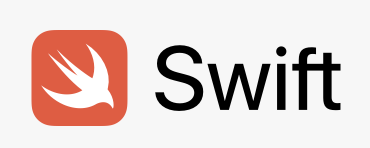

### 打开预览窗口
command + k , 随后 单独 按下 v 。

### 修改预览窗口的背景色

在VSCode的“设置”搜索框中输入“Preview Theme“，找到 -- Markdown-preview-enhanced: Preview Theme，随后选择需要的css即可，这里选择了atom-drak.css。

**重点加粗** 也可以选中后 Ctrl + B

*斜体* 也可以选中后 Ctrl + I

~~删除线~~

==高亮==

* 无序列表
  * 嵌套无序列表
  * 嵌套无序列表
* 无序列表
* 无序列表

1. 有序列表 1
   1. 嵌套有序列表 1
   2. 嵌套有序列表 2
2. 有序列表 2
3. 有序列表 3

任务列表:
- [x] 已经完成的事 1
- [x] 已经完成的事 2
- [x] 已经完成的事 3
- [ ] 仍未完成的事 4
- [ ] 仍未完成的事 5

代码缩进：(好像只在源代码中有效，预览中没有效果)
  Command + ] 是代码向右缩进
  Command + [ 是代码向左缩进

> 引用别人的话

代码块语法：
``` swift
var a: String = "a"
print(a)
```

超链接及图片：
[TennisScore](https://www.tennisscore.top)

也可以链接本地的其他md文件。

注释(预览是看不见的):
<!-- 你看不见我 -->
<!-- 多行注释
就像这样 -->

输入空格:
紧贴 $a\!b$
没有空格 $ab$
小空格 $a\,b$
中等空格 $a\;b$
大空格 $a\ b$
quad 空格 $a\quad b$
两个quad 空格 $a\qquad b$
